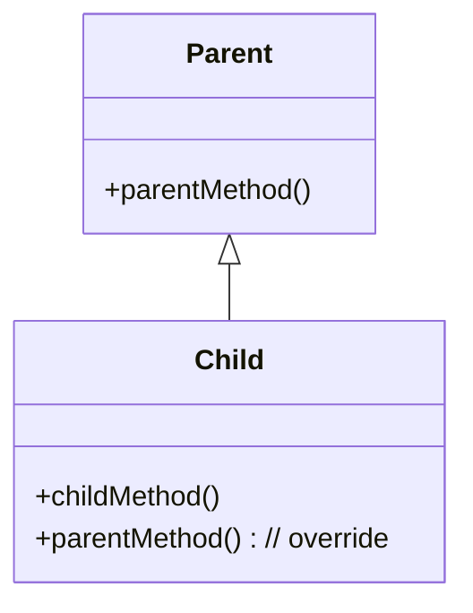
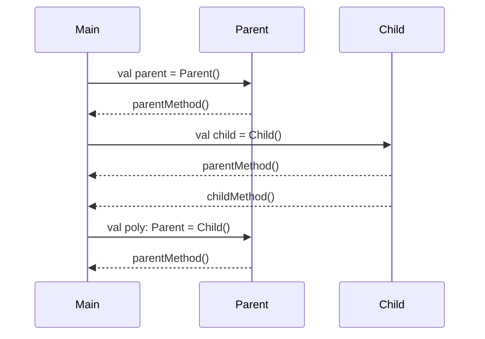
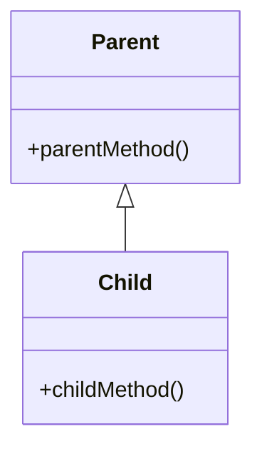
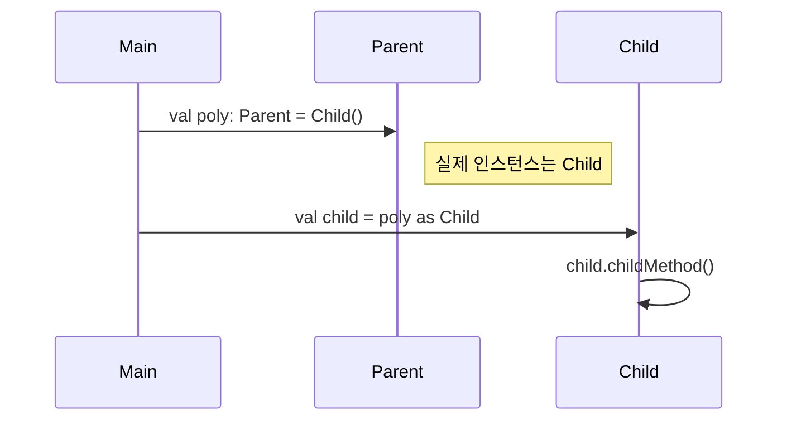
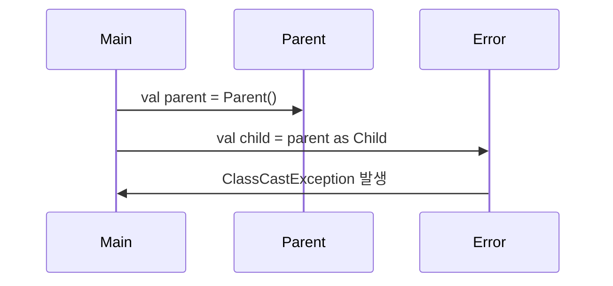
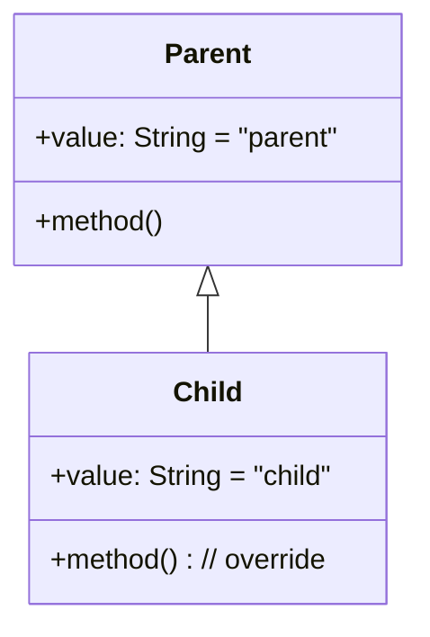
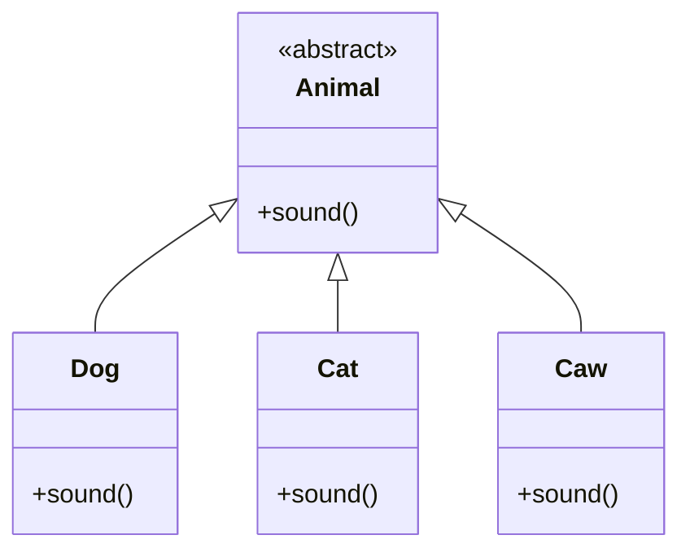
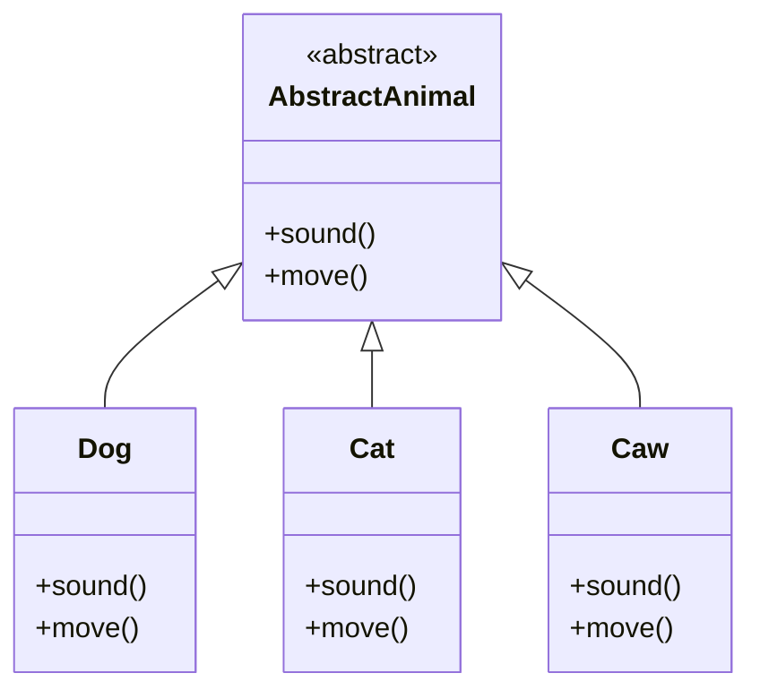
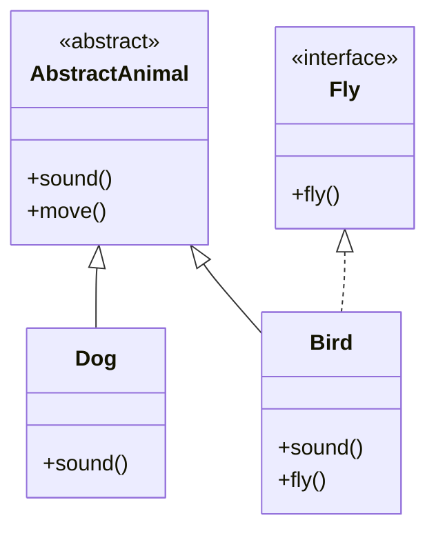

# 🌸 다형성(Polymorphism) 핵심 정리
## 1. 📌 정의
- 다형성이란 하나의 객체가 여러 타입으로 참조될 수 있는 능력
- Kotlin에서도 부모 타입의 변수로 자식 객체를 참조할 수 있음
- 이를 통해 코드의 유연성과 확장성이 향상됨

## 2. 🧠 핵심 이론
| 개념             | 설명                                                                 |
|------------------|----------------------------------------------------------------------|
| 다형적 참조       | `val poly: Parent = Child()`<br>부모 타입 변수로 자식 객체를 참조 가능 |
| 동적 디스패치     | `poly.parentMethod()` 호출 시 실제 인스턴스인 `Child`의 오버라이드 메서드가 실행됨 |
| 정적 타입 제한    | `poly.childMethod()`는 호출 불가. `poly`는 `Parent` 타입으로 선언되었기 때문 |
| 안전한 다운캐스팅 | `if (poly is Child) poly.childMethod()`로 자식 기능을 안전하게 호출 가능 |


## 3. 🧪 코드 흐름 요약
```kotlin
open class Parent {
    open fun parentMethod() = println("Parent method")
}

class Child : Parent() {
    fun childMethod() = println("Child method")
    override fun parentMethod() = println("Child overrides parent method")
}

fun main() {
    val parent = Parent()       // Parent → Parent
    val child = Child()         // Child → Child
    val poly: Parent = Child()  // Parent → Child (다형적 참조)

    parent.parentMethod()       // ✅ Parent method
    child.parentMethod()        // ✅ Child overrides parent method
    child.childMethod()         // ✅ Child method
    poly.parentMethod()         // ✅ Child overrides parent method
    // poly.childMethod()       // ❌ 컴파일 오류
}
```

- ✅ poly.parentMethod()는 호출 가능
- ❌ poly.childMethod()는 Parent 타입에는 없기 때문에 호출 불가


## 4. ⚠️ 주의점
- 부모 타입으로 참조하면 자식의 고유 기능은 보이지 않음
- 자식의 기능을 사용하려면 명시적 캐스팅 필요
```rust
if (poly is Child) {
    poly.childMethod() // ✅ 안전한 다운캐스팅
}
```


## 📐 Mermaid 클래스 다이어그램



## 🔄 다형적 참조 흐름 다이어그램


## 🧩 요약
| 코드                                 | 호출 가능한 메서드                  |
|--------------------------------------|-------------------------------------|
| `val parent = Parent()`              | `parentMethod()`                    |
| `val child = Child()`                | `parentMethod()`, `childMethod()`   |
| `val poly: Parent = Child()`         | `parentMethod()`                    |
| `poly.childMethod()`                 | ❌ 호출 불가 (Parent 타입에는 없음) |
| `if (poly is Child) poly.childMethod()` | ✅ `childMethod()` 호출 가능 (형변환) |

---

# 🔁 업캐스팅과 다운캐스팅  
## 🧠 핵심 요약
| 개념                     | 설명 또는 예시                                                      |
|--------------------------|---------------------------------------------------------------------|
| 업캐스팅                 | 자식 → 부모 타입으로 변환. 자동 변환되며 안전함                      |
| 다운캐스팅               | 부모 → 자식 타입으로 변환. 명시적 캐스팅 필요 (`as`) 또는 `is` 체크 후 사용 |
| `is` / `as`              | `is`는 타입 체크, `as`는 캐스팅 수행 → `if (poly is Child) poly.childMethod()` |
| 캐스팅 문법              | `val child = poly as Child` 또는 `if (poly is Child) { ... }`         |
| 런타임 오류 가능성       | 잘못된 다운캐스팅 시 `ClassCastException` 발생                         |

## ✅ 업캐스팅 예시
```kotlin
val child = Child()
val parent: Parent = child // 업캐스팅 (자동)
parent.parentMethod()       // 호출 가능
```


## ⚠️ 다운캐스팅 예시
```kotlin
val parent: Parent = Child()
val child = parent as Child // 다운캐스팅 (명시적)
child.childMethod()         // 호출 가능
```


## ❌ 잘못된 다운캐스팅
```kotlin
val parent: Parent = Parent()
val child = parent as Child // 런타임 오류 발생!
```


## 🎯 클래스 구조 다이어그램



## 🧩 인스턴스 흐름 다이어그램 (다운캐스팅 성공)



## ❌ 인스턴스 흐름 다이어그램 (다운캐스팅 실패)



## 🔍 Kotlin에서의 타입 확인과 다운캐스팅  
### 🧠 핵심 개념 요약: is와 스마트 캐스팅

| 코드 또는 표현식                          | 설명 또는 결과                                       |
|------------------------------------------|------------------------------------------------------|
| `val p: Parent = Child()`                | 다형적 참조. 부모 타입 변수로 자식 인스턴스를 참조 가능 |
| `val c = p as Child`                     | 다운캐스팅. 실제 인스턴스가 Child가 아니면 예외 발생     |
| `obj is Child`                           | 타입 확인. obj가 Child 타입인지 Boolean으로 반환         |
| `if (obj is Child)`                      | 타입 확인 후 블록 내에서 스마트 캐스팅 가능              |
| `if (obj is Child) obj.childMethod()`    | 안전한 다운캐스팅 없이 자식 메서드 호출 가능             |


### ✅ 예제: Kotlin에서 안전한 다운캐스팅
```kotlin
open class Parent {
    open fun method() = println("Parent method")
}

class Child : Parent() {
    fun childMethod() = println("Child method")
    override fun method() = println("Child overrides parent method")
}

fun main() {
    val parent: Parent = Child()

    // 안전한 타입 확인 + 스마트 캐스팅
    if (parent is Child) {
        parent.childMethod() // ✅ 자동 캐스팅됨
    }

    // 잘못된 다운캐스팅
    val wrongParent: Parent = Parent()
    val child = wrongParent as Child // ❌ 런타임 오류 발생
}
```


### 🧩 타입 확인 흐름
flowchart TD
    A[객체 생성: Parent → Child]
    B[is 검사]
    C[스마트 캐스팅 수행]
    D[Child 메서드 호출]
    E[예외 발생 또는 무시]

    A --> B
    B -->|true| C
    C --> D
    B -->|false| E


### 🔍 is 결과 예시
| 표현식                  | 결과  | 설명                                      |
|-------------------------|--------|-------------------------------------------|
| `Parent() is Parent`    | `true` | Parent 인스턴스는 Parent 타입과 일치       |
| `Child() is Parent`     | `true` | Child는 Parent를 상속하므로 Parent로 인식 가능 |
| `Parent() is Child`     | `false`| Parent 인스턴스는 Child 타입이 아님        |
| `Child() is Child`      | `true` | Child 인스턴스는 Child 타입과 일치         |


---

# 🧠 다형성과 오버라이딩

## 🔹 다형적 참조
```kotlin
val poly: Parent = Child()
```

- 다양한 자식 객체를 하나의 부모 타입으로 다룰 수 있어 유연한 설계 가능
## 🔹 메서드 오버라이딩
```kotlin
open class Parent {
    open fun method() = println("Parent method")
}

class Child : Parent() {
    override fun method() = println("Child method")
}
```

- 다형적 참조에서도 실제 인스턴스의 오버라이딩된 메서드가 호출됨

## 🔹 멤버 변수 vs 메서드
Kotlin에서는 멤버 변수도 오버라이딩 가능하지만, 기본적으로 참조 타입 기준으로 동작함.
| 항목         | 오버라이딩 여부 | 참조 기준       | 실행 결과 예시                                  |
|--------------|------------------|------------------|--------------------------------------------------|
| 멤버 변수     | ✅ 오버라이딩 가능 | 참조 변수 타입 기준 | `val poly: Parent = Child(); poly.value → "parent"` |
| 메서드        | ✅ 오버라이딩 됨   | 인스턴스 타입 기준 | `poly.method() → Child.method`                     |


## ✅ 실행 결과 분석
```kotlin
open class Parent {
    open val value = "parent"
    open fun method() = println("Parent method")
}

class Child : Parent() {
    override val value = "child"
    override fun method() = println("Child method")
}

fun main() {
    val child = Child()
    println(child.value) // "child"
    child.method()       // Child method

    val parent = Parent()
    println(parent.value) // "parent"
    parent.method()       // Parent method

    val poly: Parent = Child()
    println(poly.value)   // "parent" ← 참조 타입 기준
    poly.method()         // Child method ← 인스턴스 기준
}
```


## 📊 클래스 구조 다이어그램


---


# 🧠 다형성 활용: 동물 소리 예제
## 🎯 문제 상황
```kotlin
class Dog {
    fun sound() = println("멍멍")
}

class Cat {
    fun sound() = println("냐옹")
}

class Caw {
    fun sound() = println("음매")
}
```

- 각 클래스마다 sound() 메서드 존재
- 공통 타입이 없어 배열이나 반복문으로 처리 불가

## 💡 해결 방향: 추상 클래스 도입
```rust
abstract class Animal {
    abstract fun sound()
}

class Dog : Animal() {
    override fun sound() = println("멍멍")
}

class Cat : Animal() {
    override fun sound() = println("냐옹")
}

class Caw : Animal() {
    override fun sound() = println("음매")
}
```


## ✅ 다형적 참조 + 반복문
```rust
fun soundAnimal(animal: Animal) {
    println("동물 소리 테스트 시작")
    animal.sound()
    println("동물 소리 테스트 종료")
}

fun main() {
    val animals: List<Animal> = listOf(Dog(), Cat(), Caw())
    for (animal in animals) {
        soundAnimal(animal)
    }
}
```

- 공통 타입 Animal로 배열 구성 가능
- 반복문으로 각 동물의 소리를 출력
- 새로운 동물 추가 시에도 기존 로직 변경 없음

## 📊 클래스 구조 다이어그램



## Kotlin에서의 추상 클래스
### 🔹 추상 클래스란?
- 실체가 없는 부모 클래스 → 직접 인스턴스 생성 불가
- 자식 클래스에게 공통 기능을 제공하고, 일부 기능은 반드시 구현하도록 강제
### ✅ 선언 예시
```kotlin
abstract class AbstractAnimal {
    abstract fun sound() // 추상 메서드
    open fun move() {
        println("동물이 움직입니다.")
    }
}
```

- abstract 키워드로 클래스와 메서드 선언
- 추상 메서드는 바디 없음 → 자식 클래스에서 반드시 override 필요
- 일반 메서드는 open으로 선언 → 오버라이딩 선택 가능

### ✅ 추상 클래스의 장점
| 코드 또는 상황                          | 설명 또는 효과                                               |
|----------------------------------------|--------------------------------------------------------------|
| `AbstractAnimal()`                     | ❌ 인스턴스 생성 불가 → 실수 방지, 추상 개념 보호             |
| `val animal: AbstractAnimal = Dog()`   | ✅ 다형적 참조 가능 → 유연한 설계, 공통 인터페이스 활용 가능   |
| `animal.move()`                        | ✅ 부모 클래스의 일반 메서드 호출 가능 → 공통 기능 재사용       |
| `animal.sound()`                       | ✅ 자식 클래스의 오버라이딩된 메서드 호출 → 동적 디스패치       |


### 🧪 사용 예시
```kotlin
class Dog : AbstractAnimal() {
    override fun sound() {
        println("멍멍")
    }
}

val animal: AbstractAnimal = Dog()
animal.sound() // Dog의 오버라이딩된 메서드 호출
animal.move()  // 부모 클래스의 일반 메서드 호출
```


### ⚠️ 오류 예시
#### 1. 추상 클래스 인스턴스 생성 시
```kotlin
val animal = AbstractAnimal() // ❌ 오류: Cannot create an instance of an abstract class
```

#### 2. 추상 메서드 오버라이딩 누락 시
```kotlin
class Dog : AbstractAnimal() {
    // sound() 오버라이딩 누락 → ❌ 오류 발생
}
```


## 🧠 순수 추상 클래스 (인터페이스처럼 동작)
### 🔹 정의
- 모든 메서드가 추상 메서드인 클래스
- 실행 로직 없이 규격만 제공 → 자식 클래스가 반드시 구현
### ✅ 예시
```kotlin
abstract class AbstractAnimal {
    abstract fun sound()
    abstract fun move()
}
```

## 📌 특징 요약
| 코드 또는 개념                     | 설명 또는 효과                                               |
|----------------------------------|--------------------------------------------------------------|
| `AbstractAnimal()`               | ❌ 인스턴스 생성 불가 → 추상 개념 보호, 실수 방지              |
| `abstract fun sound()`           | ✅ 자식 클래스에서 반드시 오버라이딩해야 함 → 구현 강제          |
| `open fun move()`                | ✅ 공통 기능 제공 → 자식 클래스에서 선택적으로 오버라이딩 가능   |
| `val animal: AbstractAnimal = Dog()` | ✅ 다형적 참조 가능 → 유연한 설계, 공통 인터페이스 활용 가능   |


## 📊 클래스 구조 다이어그램


---

# 🧠 Kotlin에서의 인터페이스
## 🔹 인터페이스란?
- 실행 로직 없이 규격만 정의하는 설계도
- 모든 메서드는 기본적으로 추상적이며, default 구현도 가능
- 다중 구현 가능
## ✅ 선언 예시
```kotlin
interface Fly {
    fun fly()
}
```
## ✅ 인터페이스의 특징
| 코드 또는 개념                     | 설명 또는 효과                                                  |
|----------------------------------|------------------------------------------------------------------|
| `Fly()`                          | ❌ 인스턴스 생성 불가 → 인터페이스는 설계도 역할만 수행             |
| `val flyer: Fly = Bird()`        | ✅ 다형적 참조 가능 → 공통 인터페이스 기반으로 유연한 설계 가능       |
| `interface A, B`                 | ✅ 다중 구현 가능 → 여러 인터페이스를 동시에 구현할 수 있음          |


## 🔧 클래스 vs 추상 클래스 vs 인터페이스

| 구분             | 인스턴스 생성 | 메서드 구현 여부               | 선언 키워드 | 다중 상속/구현 | 용도 및 특징                                 |
|------------------|----------------|--------------------------------|--------------|----------------|----------------------------------------------|
| 클래스           | ✅ 가능         | ✅ 필수                        | `class`       | ❌ 불가능       | 기능 구현 중심, 일반적인 클래스 구조            |
| 추상 클래스       | ❌ 불가         | ✅ 일부 구현 가능, 일부 추상     | `abstract class` | ❌ 불가능       | 공통 기능 제공 + 일부 강제 구현, 다형성 지원     |
| 인터페이스       | ❌ 불가         | ✅ 구현 선택 가능 (default 가능) | `interface`   | ✅ 가능         | 규격 정의, 다형성 + 다중 구현 지원               |


## 🧠 클래스와 인터페이스 활용 예시
```kotlin
abstract class AbstractAnimal {
    abstract fun sound()
    open fun move() {
        println("동물이 이동합니다.")
    }
}

interface Fly {
    fun fly()
}

class Dog : AbstractAnimal() {
    override fun sound() = println("멍멍")
}

class Bird : AbstractAnimal(), Fly {
    override fun sound() = println("짹짹")
    override fun fly() = println("새 날기")
}
```


## ✅ 다형적 참조 예시
```kotlin
fun soundAnimal(animal: AbstractAnimal) {
    animal.sound()
}

fun flyAnimal(flyer: Fly) {
    flyer.fly()
}

fun main() {
    val dog = Dog()
    val bird = Bird()

    soundAnimal(dog)   // 멍멍
    soundAnimal(bird)  // 짹짹
    flyAnimal(bird)    // 새 날기
}
```


## 📊 클래스 구조 다이어그램



## ✅ Kotlin 인터페이스의 기본 구현 (default)
### 🔹 선언 방법
```kotlin
interface Animal {
    fun sound() // 추상 메서드

    fun move() { // 기본 구현 제공
        println("동물이 움직입니다.")
    }
}
```

- sound()는 추상 메서드 → 반드시 구현 필요
- move()는 기본 구현이 있으므로 자식 클래스에서 선택적으로 오버라이딩 가능

### 🧪 구현 예시
```kotlin
class Dog : Animal {
    override fun sound() {
        println("멍멍")
    }
    // move()는 오버라이딩하지 않아도 기본 구현 사용됨
}


fun main() {
    val dog: Animal = Dog()
    dog.sound() // 멍멍
    dog.move()  // 동물이 움직입니다.
}
```


## 📌 Kotlin 인터페이스 특징 요약
| 코드 또는 개념                     | 설명 또는 효과                                                  |
|----------------------------------|------------------------------------------------------------------|
| `interface` + `fun move() {}`    | ✅ 기본 구현 가능 → 자식 클래스에서 선택적으로 오버라이딩 가능       |
| `override`                       | ✅ 자식 클래스에서 인터페이스 메서드를 재정의할 때 사용               |
| 다중 구현 충돌                   | ❌ 동일한 메서드가 여러 인터페이스에 존재할 경우 충돌 가능            |
| `super<인터페이스>.method()`     | ✅ 충돌 해결 방법 → 어떤 인터페이스의 구현을 사용할지 명시적으로 지정 |


## ⚠️ 다중 인터페이스 충돌 예시
```kotlin
interface A {
    fun hello() = println("Hello from A")
}

interface B {
    fun hello() = println("Hello from B")
}

class C : A, B {
    override fun hello() {
        super<A>.hello() // 또는 super<B>.hello()
    }
}
```
- Kotlin은 명시적으로 어떤 인터페이스의 구현을 사용할지 지정해야 함


---


## ✅ is + 스마트 캐스팅
```kotlin
if (poly is Child) {
    poly.childMethod() // ✅ 안전하게 호출 가능
}
```

- is는 타입 확인 연산자 → poly가 실제로 Child 타입인지 검사
- Kotlin은 if 블록 안에서 스마트 캐스팅을 자동으로 수행
- 즉, poly가 Child로 확인되면, 블록 내부에서는 poly를 Child처럼 다룰 수 있음
- 명시적 as 캐스팅 없이도 안전하게 자식 메서드 호출 가능

## ⚠️ as는 강제 캐스팅
```kotlin
val child = poly as Child
child.childMethod()
```

- as는 명시적 다운캐스팅 연산자
- 타입 확인 없이 강제로 캐스팅하므로, 실제 인스턴스가 Child가 아니면 ClassCastException 발생
- 안전하게 사용하려면 is로 먼저 확인한 뒤 as를 쓰는 방식이 필요:
```kotlin
if (poly is Child) {
    val child = poly as Child //Unnecessary operation
    child.childMethod()
}
```

하지만 위처럼 as를 쓰는 건 불필요한 중복.
Kotlin은 이미 is로 확인된 경우, 블록 내부에서 자동으로 캐스팅해주기 때문.

## 🔍 결론
| 키워드 | 역할               | 캐스팅 방식       | 안전성       | 예외 발생 가능성         |
|--------|--------------------|-------------------|--------------|--------------------------|
| `is`   | 타입 확인           | 스마트 캐스팅     | ✅ 안전함     | ❌ 없음                   |
| `as`   | 명시적 타입 변환    | 강제 캐스팅       | ⚠️ 위험함     | ✅ `ClassCastException` 가능 |

즉, if (poly is Child) 블록 안에서는 poly.childMethod()가 정상적으로 작동합니다.
as로 바꿀 필요 없고, 오히려 is가 더 안전하고 Kotlin스러운 방식.

---

# as? / when

Kotlin에서의 두 가지 다운캐스팅 방식 — as?를 활용한 null-safe 캐스팅과 when을 활용한 타입 분기

## ✅ 1. as?를 활용한 Null-safe 캐스팅
### 🔹 개념
- as?는 실패해도 예외를 발생시키지 않고 null을 반환하는 안전한 캐스팅 연산자
- 잘못된 타입일 경우 ClassCastException 대신 null을 반환하므로 앱이 안전하게 동작함

### 🔧 예시
```kotlin
val parent: Parent = Parent()
val child: Child? = parent as? Child
child?.childMethod() // Will not be called if null
```

📌 특징 요약
| 키워드 또는 개념         | 설명 또는 효과                                               |
|--------------------------|--------------------------------------------------------------|
| `ClassCastException → null` | `as?` 사용 시 잘못된 캐스팅은 예외 대신 `null` 반환               |
| `?.`                     | null-safe 호출 연산자 → `child?.childMethod()`처럼 안전하게 사용 가능 |
| `is`                     | 타입 확인 연산자 → 스마트 캐스팅 가능, 예외 없이 안전하게 분기 처리   |


## ✅ 2. when을 활용한 타입 분기
### 🔹 개념
- `when` 은 Kotlin의 타입 분기 제어문으로, is와 함께 사용하면 타입별로 다른 로직을 실행할 수 있음
- 각 분기 내에서는 스마트 캐스팅이 자동으로 적용됨
### 🔧 예시
```kotlin
fun handle(animal: AbstractAnimal) {
    when (animal) {
        is Dog -> animal.sound() // Dog로 스마트 캐스팅됨
        is Bird -> {
            animal.sound()
            animal.fly() // Fly 인터페이스도 구현했을 경우
        }
        else -> println("알 수 없는 동물")
    }
}
```

## 📌 특징 요약
| 키워드 또는 구조     | 설명 또는 효과                                               |
|----------------------|--------------------------------------------------------------|
| `is`                 | 타입 확인 연산자 → 스마트 캐스팅 가능, 안전하게 다운캐스팅 처리 |
| `if-else`            | 조건 분기 가능하지만 타입별 처리에는 다소 장황해질 수 있음       |
| `when`               | 타입별 분기에 최적화된 구조 → 가독성 높고 스마트 캐스팅 자동 적용 |


## 🎯 결론 비교
| 방식         | 안전성       | 캐스팅 방식         | 예외 발생 가능성     | 용도 및 특징                                 |
|--------------|--------------|----------------------|----------------------|----------------------------------------------|
| `as?`        | ✅ 매우 안전  | 명시적 + null 반환    | ❌ 없음 (null 반환)    | 실패 시 null 처리 가능, `?.`와 함께 사용       |
| `when + is`  | ✅ 매우 안전  | 자동 스마트 캐스팅    | ❌ 없음               | 타입별 분기 처리에 최적화, 가독성 뛰어남        |


## 🔍 Kotlin이 C#에서 가져온 좋은 구조들
| Kotlin 구조       | C# 구조                      | 공통 개념 또는 역할             | 특징 요약                                 |
|-------------------|------------------------------|----------------------------------|--------------------------------------------|
| `interface`       | `interface` + `default`      | 인터페이스 기본 구현             | 공통 로직 재사용 가능, 다중 구현 충돌 방지     |
| `is`              | `is`                         | 타입 확인                        | 스마트 캐스팅 지원, 안전한 타입 분기 처리       |
| `as`, `as?`       | `as`, `as?`                  | 명시적/안전한 캐스팅             | 실패 시 예외 또는 null 반환, 안전성 확보        |
| `when` + `is`     | `switch` + 패턴 매칭         | 타입 기반 분기 처리              | 가독성 높고, 스마트 캐스팅 자동 적용           |
| `sealed class`    | `abstract class` + `enum`    | 제한된 타입 계층                 | 안전한 분기 처리, 컴파일러가 모든 경우 체크 가능 |
| `data class`      | `record` (C# 9 이후)         | 불변 데이터 구조                 | 자동 생성된 equals/hashCode/toString 지원     |


---
