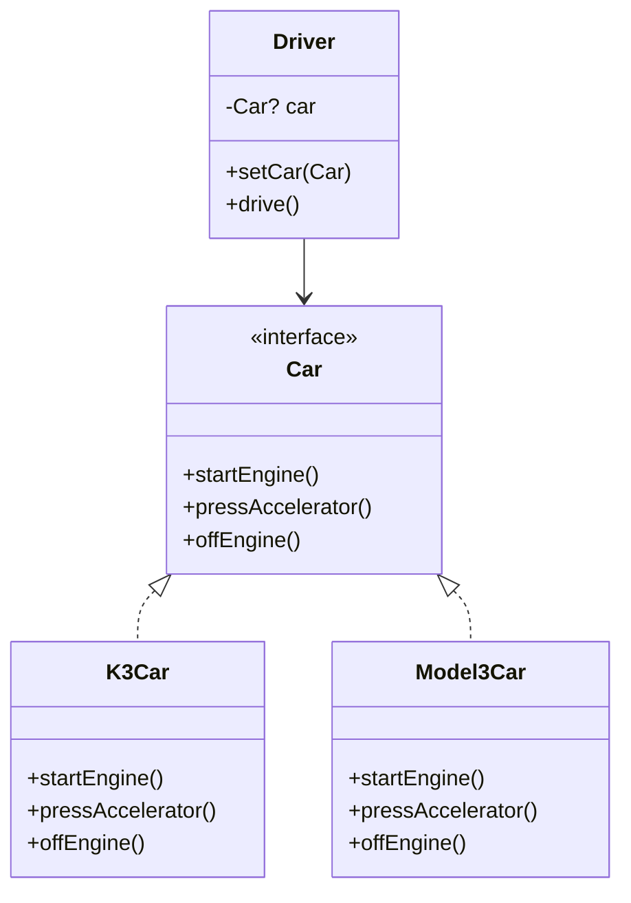
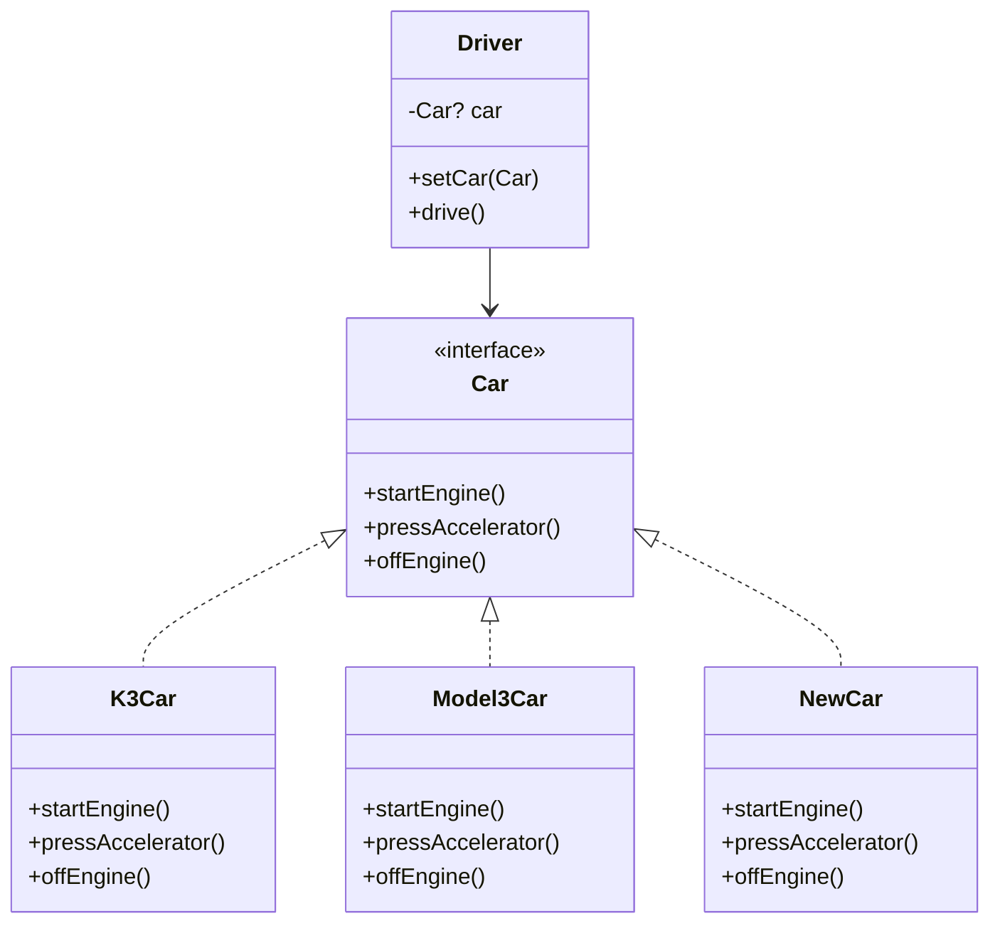

# 🎯 OOP 설계
인터페이스, 클래스, 다형성, 역할 분리 등 핵심 개념을 Kotlin 코드와 함께 설명

## 1️⃣ 객체 중심 사고 → 클래스와 메시지 기반 협력
```kotlin
interface MessageReceiver {
    fun receive(message: String)
}

class Client(private val server: MessageReceiver) {
    fun sendMessage() {
        server.receive("Hello from client")
    }
}

class Server : MessageReceiver {
    override fun receive(message: String) {
        println("Server received: $message")
    }
}
```

- 객체는 서로 메시지를 주고받으며 협력
- Client와 Server는 독립적이지만 인터페이스를 통해 연결됨

## 2️⃣ 역할과 구현의 분리 → 인터페이스 기반 설계
```kotlin
interface PaymentProcessor {
    fun process(amount: Int)
}

class KakaoPay : PaymentProcessor {
    override fun process(amount: Int) {
        println("KakaoPay 처리: ₩$amount")
    }
}

class TossPay : PaymentProcessor {
    override fun process(amount: Int) {
        println("TossPay 처리: ₩$amount")
    }
}

class Checkout(private val processor: PaymentProcessor) {
    fun pay() {
        processor.process(10000)
    }
}
```

- PaymentProcessor는 역할
- KakaoPay, TossPay는 구현
- Checkout은 역할만 알고 있음 → 구현 교체가 자유로움

## 3️⃣ 다형성 → 실행 시점에 유연한 객체 교체
```kotlin
fun main() {
    val kakao = Checkout(KakaoPay())
    val toss = Checkout(TossPay())

    kakao.pay() // KakaoPay 처리
    toss.pay()  // TossPay 처리
}
```

- 동일한 Checkout 클래스가 다양한 구현체와 함께 동작
- 런타임에 객체 교체 가능

## 4️⃣ 유연하고 변경에 강한 구조 → DI와 IoC 기반
```kotlin
class App {
    fun run() {
        val processor: PaymentProcessor = KakaoPay() // 또는 TossPay()
        val checkout = Checkout(processor)
        checkout.pay()
    }
}
```

- App은 구현체를 주입함 → 의존성 주입(DI)
- Checkout은 구현에 의존하지 않음 → 제어의 역전(IoC)

## 5️⃣ 인터페이스 설계의 중요성
```kotlin
interface UsbDevice {
    fun connect()
}

class Keyboard : UsbDevice {
    override fun connect() = println("Keyboard 연결됨")
}

class Mouse : UsbDevice {
    override fun connect() = println("Mouse 연결됨")
}
```

- UsbDevice가 바뀌면 모든 구현체에 영향
- 안정적인 인터페이스 설계가 핵심

## ✅ 핵심 요약

| 개념               | Kotlin 구현 방식                                                   |
|--------------------|------------------------------------------------------------------|
| 객체 협력           | 클래스 간 메시지 전달 → 인터페이스 기반 협력 구조                     |
| 역할과 구현 분리     | `interface`로 역할 정의, `class`로 구현 → 유연하고 변경에 강한 구조     |
| 다형성              | 하나의 인터페이스로 다양한 구현체를 런타임에 교체 가능                  |
| 인터페이스 설계 중요 | 인터페이스 변경 시 모든 구현체 영향 → 안정적이고 신중한 설계 필요         |
| 유연한 구조 비유     | DI로 객체 교체 가능 → 레고 블럭처럼 조립형 구조 구현 가능                |
| 디자인 패턴 기반     | 전략 패턴, 의존성 주입 등 대부분의 패턴은 인터페이스 기반 다형성 활용       |

---

# ✅ 다형성 설계
## 1️⃣ 역할 정의: 인터페이스
```kotlin
interface Car {
    fun startEngine()
    fun pressAccelerator()
    fun offEngine()
}
```

## 2️⃣ 구현체: K3Car, Model3Car
```kotlin
class K3Car : Car {
    override fun startEngine() = println("K3Car.startEngine")
    override fun pressAccelerator() = println("K3Car.pressAccelerator")
    override fun offEngine() = println("K3Car.offEngine")
}

class Model3Car : Car {
    override fun startEngine() = println("Model3Car.startEngine")
    override fun pressAccelerator() = println("Model3Car.pressAccelerator")
    override fun offEngine() = println("Model3Car.offEngine")
}
```


## 3️⃣ 클라이언트: Driver 클래스
```kotlin
class Driver {
    private var car: Car? = null

    fun setCar(car: Car) {
        println("자동차를 설정합니다: ${car::class.simpleName}")
        this.car = car
    }

    fun drive() {
        println("자동차를 운전합니다.")
        car?.startEngine()
        car?.pressAccelerator()
        car?.offEngine()
    }
}
```


## 4️⃣ 실행 예시: main 함수
```kotlin
fun main() {
    val driver = Driver()

    val k3 = K3Car()
    driver.setCar(k3)
    driver.drive()

    val model3 = Model3Car()
    driver.setCar(model3)
    driver.drive()
}
```


## 📊 클래스 구조도



## 💡 구조 해설
- Car는 역할 (인터페이스)
- K3Car, Model3Car는 구현체
- Driver는 Car 타입만 참조 → 구현체 교체 가능
- setCar()를 통해 의존성 주입(DI) → 실행 중에도 교체 가능
- 새로운 차량 추가 시 Driver는 변경 없음 → OCP 원칙 준수

## ✅ 핵심 요약
| 구성 요소            | 설명 또는 역할                                               |
|----------------------|--------------------------------------------------------------|
| `Car`, `K3Car`, `Model3Car` | `Car`은 인터페이스(역할), `K3Car`, `Model3Car`는 구현체                    |
| `Driver → Car`       | `Driver`는 `Car` 타입만 참조 → 구현체와 분리된 유연한 구조               |
| `Driver.setCar(Car)` | 의존성 주입(DI) 방식으로 구현 객체 설정 → 실행 중에도 교체 가능           |
| `Driver.drive()`     | `Car` 인터페이스의 메서드 호출 → 다형성 기반 실행                     |
| `Driver` 유지보수성  | 새로운 차량 추가 시 `Driver`는 변경 없음 → OCP 원칙 준수                 |
| `Driver` 확장성      | 다양한 자동차를 유연하게 운전 가능 → 확장에 열려 있고 변경에는 닫힌 구조     |


## ✅ OCP 원칙 & 전략 패턴
### 🔹 역할 정의: 전략 인터페이스
```kotlin
interface Car {
    fun startEngine()
    fun pressAccelerator()
    fun offEngine()
}
```

### 🔹 전략 구현체: 다양한 자동차
```kotlin
class K3Car : Car {
    override fun startEngine() = println("K3Car.startEngine")
    override fun pressAccelerator() = println("K3Car.pressAccelerator")
    override fun offEngine() = println("K3Car.offEngine")
}

class Model3Car : Car {
    override fun startEngine() = println("Model3Car.startEngine")
    override fun pressAccelerator() = println("Model3Car.pressAccelerator")
    override fun offEngine() = println("Model3Car.offEngine")
}

class NewCar : Car {
    override fun startEngine() = println("NewCar.startEngine")
    override fun pressAccelerator() = println("NewCar.pressAccelerator")
    override fun offEngine() = println("NewCar.offEngine")
}
```


### 🔹 클라이언트: 전략을 사용하는 Driver
```kotlin
class Driver {
    private var car: Car? = null

    fun setCar(car: Car) {
        println("자동차를 설정합니다: ${car::class.simpleName}")
        this.car = car
    }

    fun drive() {
        println("자동차를 운전합니다.")
        car?.startEngine()
        car?.pressAccelerator()
        car?.offEngine()
    }
}
```


### 🔹 실행 예시: 전략 교체
```kotlin
fun main() {
    val driver = Driver()

    val k3 = K3Car()
    driver.setCar(k3)
    driver.drive()

    val model3 = Model3Car()
    driver.setCar(model3)
    driver.drive()

    val newCar = NewCar()
    driver.setCar(newCar)
    driver.drive()
}
```

## 📊 클래스 구조도



## ✅ 최종 요약
| 구성 요소             | 설명 또는 역할                                                   |
|-----------------------|------------------------------------------------------------------|
| `Car`, `Driver`       | `Car`은 인터페이스(역할), `Driver`는 클라이언트(사용자) 역할             |
| `Driver → Car`        | `Driver`는 `Car` 타입만 참조 → 구현체와 분리된 유연한 구조               |
| `Driver.setCar(Car)`  | 의존성 주입(DI) 방식으로 전략 객체 설정 → 실행 중에도 교체 가능           |
| `Driver.drive()`      | `Car` 인터페이스의 메서드 호출 → 다형성 기반 실행                     |
| `Car`, `K3Car`, `Model3Car`, `NewCar` | `Car`은 전략 인터페이스, 나머지는 전략 구현체                        |
| `Driver-Car 관계`     | `Driver`는 역할에만 의존 → 새로운 차량 추가 시 코드 변경 없음             |
| `main()`              | 전략 객체 생성 및 주입 → 설정만 변경하면 다양한 전략 실행 가능             |

---


## ✅ 문제 1: 다중 메시지 발송기
### 🔹 인터페이스 정의
```kotlin
interface Sender {
    fun sendMessage(message: String)
}
```


### 🔹 구현 클래스
```kotlin
class EmailSender : Sender {
    override fun sendMessage(message: String) {
        println("메일을 발송합니다: $message")
    }
}

class SmsSender : Sender {
    override fun sendMessage(message: String) {
        println("SMS를 발송합니다: $message")
    }
}

class FaceBookSender : Sender {
    override fun sendMessage(message: String) {
        println("페이스북에 발송합니다: $message")
    }
}
```


### 🔹 실행 클래스
```kotlin
fun main() {
    val senders: List<Sender> = listOf(
        EmailSender(),
        SmsSender(),
        FaceBookSender()
    )

    senders.forEach { it.sendMessage("환영합니다!") }
}
```


## ✅ 문제 2: 결제 시스템 리팩토링
### 🔹 Pay 인터페이스
```kotlin
interface Pay {
    fun pay(amount: Int): Boolean
}
```


### 🔹 결제 수단 구현 클래스
```kotlin
class KakaoPay : Pay {
    override fun pay(amount: Int): Boolean {
        println("카카오페이 시스템과 연결합니다.")
        println("${amount}원 결제를 시도합니다.")
        return true
    }
}

class NaverPay : Pay {
    override fun pay(amount: Int): Boolean {
        println("네이버페이 시스템과 연결합니다.")
        println("${amount}원 결제를 시도합니다.")
        return true
    }
}

class DefaultPay : Pay {
    override fun pay(amount: Int): Boolean {
        println("결제 수단이 없습니다.")
        return false
    }
}
```


### 🔹 PayStore 클래스
```kotlin
object PayStore {
    fun findPay(option: String): Pay = when (option) {
        "kakao" -> KakaoPay()
        "naver" -> NaverPay()
        else -> DefaultPay()
    }
}
```

### 🔹 PayService 클래스
```kotlin
class PayService {
    fun processPay(option: String, amount: Int) {
        println("결제를 시작합니다: option=$option, amount=$amount")
        val pay = PayStore.findPay(option)
        val result = pay.pay(amount)

        if (result) {
            println("결제가 성공했습니다.")
        } else {
            println("결제가 실패했습니다.")
        }
    }
}
```


###  ✅ PayMain1 — 고정된 테스트
```kotlin
fun main() {
    val payService = PayService()
    payService.processPay("kakao", 5000)
    payService.processPay("naver", 10000)
    payService.processPay("bad", 15000)
}
```


### ✅ PayMain2 — 사용자 입력 기반
```kotlin
fun main() {
    val payService = PayService()

    while (true) {
        print("결제 수단을 입력하세요: ")
        val option = readln()
        if (option == "exit") {
            println("프로그램을 종료합니다.")
            break
        }

        print("결제 금액을 입력하세요: ")
        val amount = readln().toIntOrNull() ?: continue

        payService.processPay(option, amount)
    }
}
```

## ✅ 설계 원칙 적용 요약

| 설계 원칙            | 적용 요소               | 설명                                                                 |
|----------------------|-------------------------|----------------------------------------------------------------------|
| OCP (개방-폐쇄 원칙) | `PayStore`              | 새로운 결제 수단 추가 시 기존 코드 수정 없이 확장 가능               |
| 다형성               | `Pay` 인터페이스        | 다양한 결제 수단을 동일한 방식으로 처리 가능                         |
| 안정성 (Null 방지)   | `DefaultPay`            | 결제 수단이 없을 경우에도 실패 객체를 반환하여 예외 방지             |
| DIP (의존 역전 원칙) | `PayService → Pay`      | 고수준 모듈이 추상(Pay)에만 의존 → 구현체와 분리된 유연한 구조       |

---

## ✅ DI(의존성 주입)란?
Dependency Injection은 객체가 직접 의존 객체를 생성하지 않고,  
외부에서 주입받는 방식으로 객체 간 결합도를 낮추고 유연성을 높이는 설계 패턴.

### 🔹 핵심 개념
- 의존성(Dependency): 어떤 객체가 다른 객체의 기능을 필요로 할 때
- 주입(Injection): 필요한 객체를 외부에서 전달해주는 것

### 🔹 예시 (비교)
```kotlin
// 직접 생성 (결합도 높음)
val engine = Engine()
val car = Car(engine)

// DI 방식 (결합도 낮음)
class Car(private val engine: Engine)
```


## ✅ Spring Framework와 DI
Spring은 DI를 프레임워크 수준에서 자동으로 지원해주는 대표적인 플랫폼.

### 🔹 Spring의 DI 방식
- 생성자 주입: 가장 권장되는 방식
- 필드 주입: 간편하지만 테스트 어려움
- Setter 주입: 선택적 의존성에 적합

```kotlin
@Component
class Engine

@Component
class Car(private val engine: Engine)
```

Spring은 @Component, @Autowired, @Configuration, @Bean 등을 통해  
객체를 자동으로 생성하고 주입.

## ✅ DI의 장점
| 항목             | 설명                                                             |
|------------------|------------------------------------------------------------------|
| 결합도 감소       | 객체가 직접 의존성을 생성하지 않음 → 변경에 강한 구조 형성           |
| 테스트 용이       | Mock 객체나 테스트용 구현체 주입 가능 → 단위 테스트가 쉬워짐         |
| 유연한 확장       | 구현체 교체가 자유로움 → 전략 패턴, OCP 원칙 실현 가능               |
| 유지보수성 향상    | 변경 시 영향 범위 최소화 → 안정적인 시스템 운영 가능                 |
| 코드 재사용성 증가 | 공통 인터페이스 기반으로 다양한 구현체 활용 가능 → 재사용성과 생산성 향상 |

---


# 간단한 DI 개념 분석

## ✅ 목표
- 인터페이스 기반 역할 정의
- 구현체 주입 (DI)
- 클라이언트는 역할만 의존

## 🔧 예제 코드: 심플 DI 구조
```kotlin
// 1. 역할 정의
interface MessageSender {
    fun send(message: String)
}

// 2. 구현체
class EmailSender : MessageSender {
    override fun send(message: String) {
        println("📧 이메일 발송: $message")
    }
}

// 3. 클라이언트 (의존성 주입 대상)
class NotificationService(private val sender: MessageSender) {
    fun notifyUser() {
        sender.send("환영합니다!")
    }
}

// 4. 수동 DI (main에서 주입)
fun main() {
    val sender = EmailSender() // 구현체 생성
    val service = NotificationService(sender) // DI 수행
    service.notifyUser()
}
```


## ✅ 핵심 포인트
| 구성 요소             | 역할 또는 설명                                           |
|-----------------------|----------------------------------------------------------|
| `MessageSender`       | 메시지 전송 역할을 정의하는 인터페이스 (추상화)             |
| `EmailSender`         | `MessageSender`를 구현한 실제 메시지 전송 클래스             |
| `NotificationService` | 메시지 전송 기능을 사용하는 클라이언트 → 역할에만 의존       |
| `main()`              | 구현체를 생성하고 `NotificationService`에 주입하는 설정 코드 |

---

# ✅ when 표현식

```kotlin
interface Pay {
    fun pay(amount: Int): Boolean
}

class KakaoPay : Pay {
    override fun pay(amount: Int): Boolean {
        println("카카오페이로 $amount원 결제 시도")
        return true
    }
}

class NaverPay : Pay {
    override fun pay(amount: Int): Boolean {
        println("네이버페이로 $amount원 결제 시도")
        return true
    }
}

class DefaultPay : Pay {
    override fun pay(amount: Int): Boolean {
        println("결제 수단이 없습니다.")
        return false
    }
}

class PayService {
    fun processPay(option: String, amount: Int) {
        val pay: Pay = when (option) {
            "kakao" -> KakaoPay()
            "naver" -> NaverPay()
            else -> DefaultPay()
        }

        val result = pay.pay(amount)
        println(if (result) "결제 성공" else "결제 실패")
    }
}
```


## ✅ 실행 예시
```kotlin
fun main() {
    val service = PayService()
    service.processPay("kakao", 5000)
    service.processPay("naver", 10000)
    service.processPay("unknown", 15000)
}
```
## 🎯 장점
| 항목           | 설명                                                             |
|----------------|------------------------------------------------------------------|
| `when` 표현식   | 조건 분기 없이 객체 선택을 깔끔하게 처리 → 가독성과 유지보수성 향상     |
| `PayService → Pay` | 클라이언트는 인터페이스(Pay)에만 의존 → 구현체와 분리된 유연한 구조       |
| 전략 선택 구조   | `when` 블록에서 구현체를 선택 → 전략 교체가 명확하고 직관적               |

---

