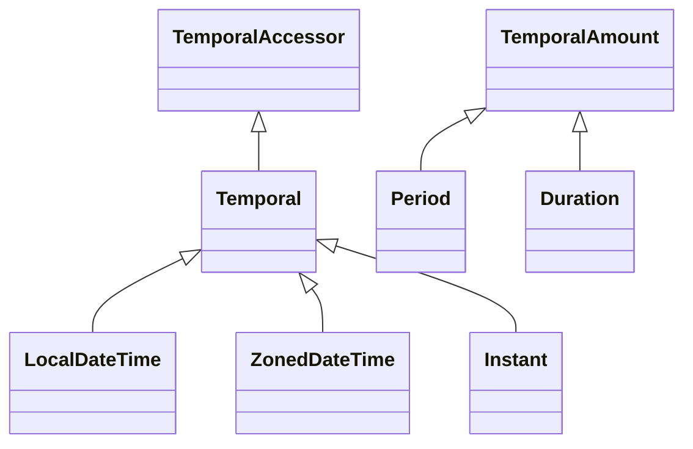
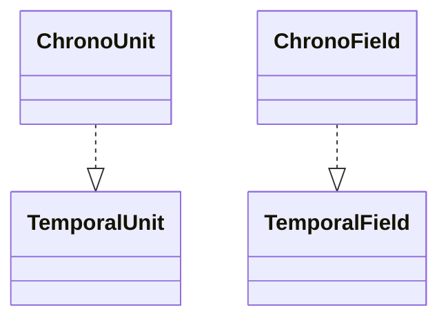

# 날짜와 시간

## 📅 날짜와 시간 라이브러리가 필요한 이유
날짜와 시간 계산은 단순해 보이지만 실제로는 매우 복잡합니다.  
정확한 처리를 위해서는 다음과 같은 요소들을 고려해야 합니다:

### 1. 날짜 간 차이 계산
- 각 달의 일수가 다름 (예: 1월은 31일, 2월은 28일 또는 29일)
- 윤년 여부에 따라 일수 변화
- 단순한 뺄셈으로는 정확한 일수 계산이 어려움
#### 예시:
```
2024년 1월 1일 → 2024년 2월 1일 = 31일
2024년 1월 1일 → 2024년 3월 1일 = 60일 (윤년 고려)
```
### 2. 윤년 계산
- 지구 공전 주기: 약 365.2425일
- 윤년 규칙:
- 4년마다 윤년
- 100년 단위는 윤년 아님
- 400년 단위는 윤년
#### 예시:
```
2000년, 2020년 → 윤년
1900년, 2100년 → 윤년 아님
```

### 3. 일광 절약 시간(DST)
- 특정 기간(보통 3월~10월)에 1시간 앞당김
- 지역마다 적용 여부와 시작/종료 날짜가 다름
- 시간 계산 시 1시간 오차 발생 가능
### 예시:
```
베를린은 3월 마지막 일요일 ~ 10월 마지막 일요일까지 DST 적용
```
### 4. 타임존 계산
- 세계는 UTC 기준으로 다양한 타임존을 가짐
- 타임존 간 시간 차이 계산 필요
- DST 적용 시 타임존 차이도 변함
#### 예시:
```
서울(UTC+9)에서 오후 9시 → 베를린(UTC+1)은 오후 1시
DST 적용 시 → 베를린은 UTC+2 → 오후 2시
```

## 🕰️ 자바 날짜와 시간 라이브러리의 역사
### JDK 1.0 – java.util.Date
- 타임존 처리 부족
- 날짜 연산 불편
- 변경 가능한 객체 → 버그 발생 가능
### JDK 1.1 – java.util.Calendar
- 타임존 지원 개선
- 여전히 사용성 낮고, 불변성 부족
### Joda-Time (외부 라이브러리)
- 사용성, 성능, 불변성 개선
- 자바 표준이 아니어서 별도 추가 필요
### JDK 8 – java.time 패키지 (JSR-310)
- Joda-Time의 장점을 표준 API로 통합
- 불변 객체 기반 → 사이드 이펙트 방지
- 직관적인 API 제공
- 주요 클래스: LocalDate, LocalTime, LocalDateTime, ZonedDateTime, Instant

### 📌 참고 사례: 자바 ORM 기술의 진화
- 과거 자바 ORM 기술이 불편 → Hibernate 등장
- Hibernate가 대중화되자 자바는 이를 기반으로 JPA 표준 정의
- java.time도 같은 방식으로 Joda-Time을 흡수하여 표준화

## ✅ 결론
날짜와 시간은 단순한 숫자 계산이 아니라  
윤년, 타임존, DST, 불변성, 정확성 등 다양한 요소를 고려해야 하는 복잡한 도메인입니다.  
따라서 전문적인 라이브러리의 사용은 필수이며, 자바에서는 java.time이 그 역할을 안정적으로 수행합니다.  


## 📅 java.time 클래스 구성 요소 비교
| Class or Enum    | Year | Month | Day | Hours | Minutes | Seconds* | Zone Offset | Zone ID | toString Output                          |
|------------------|------|-------|-----|-------|---------|----------|-------------|---------|------------------------------------------|
| LocalDate        | ✔    | ✔     | ✔   |       |         |          |             |         | 2013-08-20                               |
| LocalTime        |      |       |     | ✔     | ✔       | ✔        |             |         | 08:16:26.943                             |
| LocalDateTime    | ✔    | ✔     | ✔   | ✔     | ✔       | ✔        |             |         | 2013-08-20T08:16:26.943                  |
| ZonedDateTime    | ✔    | ✔     | ✔   | ✔     | ✔       | ✔        | ✔           | ✔       | 2013-08-20T16:26:26.941+09:00[Asia/Seoul]|
| OffsetDateTime   | ✔    | ✔     | ✔   | ✔     | ✔       | ✔        | ✔           |         | 2013-08-20T16:26:26.954+09:00            |
| OffsetTime       |      |       |     | ✔     | ✔       | ✔        | ✔           |         | 08:16:26.957+07:00                       |
| Month            |      | ✔     |     |       |         |          |             |         | AUGUST                                   |
| Year             | ✔    |       |     |       |         |          |             |         | 2013                                     |
| YearMonth        | ✔    | ✔     |     |       |         |          |             |         | 2013-08                                  |
| MonthDay         |      | ✔     | ✔   |       |         |          |             |         | --08-20                                  |
| Instant          |      |       |     |       |         | ***      |             |         | 2013-08-20T15:16:26.351Z                 |
| Period           | ✔    | **    | ✔   |       |         |          |             |         | P10D (10 days)                           |
| Duration         |      |       |     |       |         | **       |             |         | PT20H (20 hours)                         |

### Legend:
✔ : 지원됨  
** : 해당 단위를 직접 저장하지 않지만 관련 메서드 제공  
*** : 나노초 단위로 캡처되며, 일부 경우에만 포함됨

---

## 🗓️ 기본 날짜/시간 클래스
### LocalDate
- 용도: 날짜만 표현 (년, 월, 일)
- 예시: 2013-11-21
- 특징: 불변 객체, plusDays(), of() 등으로 생성 및 계산

#### 예시
```java
LocalDate nowDate = LocalDate.now(); //오늘 날짜 = 2024-02-09
LocalDate ofDate = LocalDate.of(2013, 11, 21); //지정 날짜 = 2013-11-21
LocalDate plusDays = ofDate.plusDays(10); //지정 날짜+10d = 2013-12-01
```

### LocalTime
- 용도: 시간만 표현 (시, 분, 초, 나노초)
- 예시: 08:20:30.213
- 특징: 불변 객체, plusSeconds(), of() 등으로 생성 및 계산

#### 예시
```java
LocalTime nowTime = LocalTime.now();  //현재 시간 = 11:52:51.219602
LocalTime ofTime = LocalTime.of(9, 10, 30); //지정 시간 = 09:10:30
LocalTime ofTimePlus = ofTime.plusSeconds(30); //지정 시간+30s = 09:11:00
```

#### LocalDateTime
- 용도: 날짜와 시간 모두 표현
- 예시: 2013-11-21T08:20:30.213
- 특징: LocalDate와 LocalTime을 합친 구조, 타임존 미포함

#### 예시
```java
LocalDateTime nowDt = LocalDateTime.now(); //현재 날짜시간 = 2024-02-09T11:54:54.389163
LocalDateTime ofDt = LocalDateTime.of(2016, 8, 16, 8, 10, 1); //지정 날짜시간 = 2016-08-16T08:10:01

//날짜와 시간 분리
LocalDate localDate = ofDt.toLocalDate(); //localDate = 2016-08-16
LocalTime localTime = ofDt.toLocalTime(); //localTime = 08:10:01

//날짜와 시간 합체
LocalDateTime localDateTime = LocalDateTime.of(localDate, localTime); //localDateTime = 2016-08-16T08:10:01

//계산(불변)
LocalDateTime ofDtPlus = ofDt.plusDays(1000); //지정 날짜시간+1000d = 2019-05-13T08:10:01
LocalDateTime ofDtPlus1Year = ofDt.plusYears(1); //지정 날짜시간+1년 = 2017-08-16T08:10:01
```
## 🔧 주요 기능 요약
| 기능 구분     | 관련 메서드                             | 설명                                      |
|---------------|------------------------------------------|-------------------------------------------|
| 생성          | `now()`, `of(...)`                      | 현재 또는 특정 날짜/시간 객체 생성         |
| 계산          | `plusDays()`, `plusYears()`             | 날짜/시간에 일수 또는 연도 추가            |
| 분리/합체     | `toLocalDate()`, `toLocalTime()`        | 날짜/시간 분리 또는 재조합                 |
| 비교          | `isBefore()`, `isAfter()`, `isEqual()`  | 시간 비교 (이전/이후/동일 여부 판단)       |


## 🌍 타임존 관련 클래스
### ZonedDateTime
- 용도: 타임존 포함 날짜/시간 표현
- 예시: 2013-11-21T08:20:30.213+09:00[Asia/Seoul]
- 특징: DST(일광 절약 시간제) 자동 반영, 실제 세계 시간 표현에 적합
#### 예시
```java
for (String availableZoneId : ZoneId.getAvailableZoneIds()) {
    ZoneId zoneId = ZoneId.of(availableZoneId);
}
// Europe/London | ZoneRules[currentStandardOffset=Z]
// UTC | ZoneRules[currentStandardOffset=Z]
// GMT | ZoneRules[currentStandardOffset=Z]
// Asia/Seoul | ZoneRules[currentStandardOffset=+09:00]
// Asia/Dubai | ZoneRules[currentStandardOffset=+04:00]
// US/Arizona | ZoneRules[currentStandardOffset=-07:00]
// Asia/Istanbul | ZoneRules[currentStandardOffset=+03:00]
// Asia/Shanghai | ZoneRules[currentStandardOffset=+08:00]
// ...
// Europe/Paris | ZoneRules[currentStandardOffset=+01:00]

ZoneId zoneId = ZoneId.systemDefault(); // ZoneId.systemDefault = Asia/Seoul
ZoneId seoulZoneId = ZoneId.of("Asia/Seoul"); // seoulZoneId = Asia/Seoul
}
```

### OffsetDateTime
- 용도: UTC 오프셋 기반 날짜/시간 표현
- 예시: 2013-11-21T08:20:30.213+09:00
- 특징: 타임존 정보 없음, DST 미적용
#### 예시
```java
OffsetDateTime nowOdt = OffsetDateTime.now();
LocalDateTime ldt = LocalDateTime.of(2030, 1, 1, 13, 30, 50);
OffsetDateTime odt = OffsetDateTime.of(ldt, ZoneOffset.of("+01:00"));
```

## 📆 날짜 단위 클래스
- Year: 연도만 표현 (2013)
- Month: 월만 표현 (AUGUST)
- YearMonth: 연도와 월 (2013-08)
- MonthDay: 월과 일 (--08-20)
- DayOfWeek: 요일 표현 (MONDAY, TUESDAY 등)

## ⏱️ 시간 지점 및 간격 클래스
### Instant
- 용도: UTC 기준 시간 지점 표현
- 예시: 2013-08-20T15:16:26.351Z
- 특징: 나노초 정밀도, 1970년 기준 초 단위 경과 시간

#### 예시
```java
Instant now = Instant.now(); //UTC 기준
ZonedDateTime zdt = ZonedDateTime.now(); //now = 2024-02-13T06:46:07.101393Z
Instant from = Instant.from(zdt); //from = 2024-02-13T06:46:07.117732Z
Instant epochStart = Instant.ofEpochSecond(0); //epochStart = 1970-01-01T00:00:00Z 
//계산
Instant later = epochStart.plusSeconds(3600); //later = 1970-01-01T01:00:00Z
//조회
long laterEpochSecond = later.getEpochSecond(); //laterEpochSecond = 3600
```

### ⚠️ isEqual() vs equals() 차이
- isEqual(): 시간적으로 같으면 true (타임존 무시)
- equals(): 객체 구성 요소까지 같아야 true (타임존 포함)
#### 예시:
```
서울 9시 (UTC+9) vs UTC 0시 → isEqual()은 true, equals()는 false
```

---

## ⏳ 자바의 시간 간격 표현 – Period vs Duration
### 🧠 시간 표현 방식
| 구분             | 설명                                | 예시                                  |
|------------------|-------------------------------------|----------------------------------------|
| 특정 시점 (시각) | 날짜나 시간의 한 지점을 표현         | 2013년 8월 16일, 11시 30분, 생일 등     |
| 시간의 간격 (기간)| 두 시점 사이의 차이 또는 지속 시간 표현 | 3개월 남음, 4년 공부, 3분 끓이기 등     |

### Period
- 용도: 날짜 간격 표현 (년, 월, 일)
- 예시: P10D (10일)
- 주요 메서드: getYears(), getMonths(), getDays()

#### ✅ 생성
```java
Period.of(1, 3, 10);      // 1년 3개월 10일
Period.ofDays(10);        // 10일
Period.between(start, end); // 두 날짜 사이의 간격
```

#### ✅ 계산 예시
```java
LocalDate date = LocalDate.of(2030, 1, 1);
LocalDate result = date.plus(Period.ofDays(10)); // → 2030-01-11
```

#### ✅ 차이 계산 예시
```java
Period between = Period.between(
    LocalDate.of(2023, 1, 1),
    LocalDate.of(2023, 4, 2)
);
```

#### 예시
```java
Period period = Period.ofDays(10); //period = P10D

//계산에 사용
LocalDate currentDate = LocalDate.of(2030, 1, 1);  //현재 날짜: 2030-01-01
LocalDate plusDate = currentDate.plus(period); //더한 날짜: 2030-01-11

//기간 차이
LocalDate startDate = LocalDate.of(2023, 1, 1);
LocalDate endDate = LocalDate.of(2023, 4, 2);
Period between = Period.between(startDate, endDate); //기간: 3개월 1일
```

### Duration
- 용도: 시간 간격 표현 (시, 분, 초)
- 예시: PT20H (20시간)
- 주요 메서드: toHours(), toMinutes(), getSeconds(), getNano()

#### ✅ 생성
```java
Duration.ofHours(2);      // 2시간
Duration.ofMinutes(30);   // 30분
Duration.between(start, end); // 두 시간 사이의 간격
```

#### ✅ 계산 예시
```java
LocalTime time = LocalTime.of(1, 0);
LocalTime result = time.plus(Duration.ofMinutes(30)); // → 01:30
```

#### ✅ 차이 계산 예시
```java
Duration between = Duration.between(
    LocalTime.of(9, 0),
    LocalTime.of(10, 0)
);
// → 3600초, 1시간 0분
```

#### 예시
```java
//생성
Duration duration = Duration.ofMinutes(30); //duration = PT30M
LocalTime lt = LocalTime.of(1, 0); //기준 시간 = 01:00

//계산에 사용
LocalTime plusTime = lt.plus(duration); //더한 시간 = 01:30

//시간 차이
LocalTime start = LocalTime.of(9, 0);
LocalTime end = LocalTime.of(10, 0);
Duration between = Duration.between(start, end); //차이: 3600초
```

#### 📊 Period vs Duration 비교

| 항목         | Period                          | Duration                          |
|--------------|----------------------------------|-----------------------------------|
| 단위         | 년, 월, 일                      | 시, 분, 초, 나노초                |
| 대상         | 날짜 (`LocalDate`)              | 시간 (`LocalTime`, `Instant`)     |
| 생성 방식    | `ofDays()`, `ofMonths()`, `between()` | `ofMinutes()`, `ofHours()`, `between()` |
| 계산 대상    | 날짜에 기간 더하기               | 시간에 지속 시간 더하기           |
| 차이 계산    | 날짜 간 차이 → `Period` 반환     | 시간 간 차이 → `Duration` 반환    |

#### 💡 실무 팁
- 날짜 간격: 프로젝트 기간, 기념일 계산 → Period
- 시간 간격: 작업 시간, 영상 길이, 처리 시간 → Duration
- 불변 객체: 계산 시 항상 새로운 객체 반환 → 반환값 꼭 저장

---

## 🧭 ZonedDateTime vs OffsetDateTime vs Instant
| 클래스            | ZoneId 포함 | ZoneOffset 포함 | DST 적용 가능 | 예시 출력                                      |
|-------------------|-------------|------------------|----------------|------------------------------------------------|
| ZonedDateTime     | ✔           | ✔                | ✔              | 2024-02-09T12:02:13+09:00[Asia/Seoul]          |
| OffsetDateTime    | ✘           | ✔                | ✘              | 2024-02-13T15:03:36+09:00                      |
| Instant           | ✘           | ✘ (UTC 고정)     | ✘              | 2024-02-13T06:46:07Z                           |

## 🔍 설명 요약
- ZonedDateTime
    - 지역 기반 시간대(ZoneId)를 포함
    - DST(일광 절약 시간제) 자동 반영
    - 글로벌 서비스나 사용자 지역 시간 표현에 적합
- OffsetDateTime
    - 고정된 오프셋(ZoneOffset)만 포함
    - DST 미적용
    - 로그 기록, 데이터 저장 등 단순 시간 표현에 적합
- Instant
    - UTC 기준의 절대 시간 지점
    - 시간대 정보 없음
    - 서버 간 시간 동기화, 타임스탬프 등에 적합

## ✅ 실무 팁
- 국내 서비스: `LocalDateTime` 또는 `ZonedDateTime` 사용
- 글로벌 서비스: `ZonedDateTime` 또는 `Instant` 사용
- 로그/데이터 저장: `Instant` 추천 (UTC 기준으로 일관성 유지)
- 시간 계산: `Instant` 또는 `Duration`, `Period` 활용

---


## 🧭 날짜와 시간의 핵심 인터페이스 정리
### 📌 시점(Time Point)
- 인터페이스: TemporalAccessor (읽기 전용), Temporal (읽기 + 쓰기)
- 구현 클래스:
- LocalDate
- LocalTime
- LocalDateTime
- ZonedDateTime
- OffsetDateTime
- Instant
### 📌 간격(Duration)
- 인터페이스: TemporalAmount
- 구현 클래스:
- Period (년, 월, 일 단위)
- Duration (시, 분, 초, 나노초 단위)


--- 

## 🧩 시간 단위와 필드

### ⏱️ TemporalUnit → ChronoUnit
| 범주       | ChronoUnit       | 설명                     |
|------------|------------------|--------------------------|
| 시간 단위   | NANOS            | 나노초                   |
|            | MICROS           | 마이크로초               |
|            | MILLIS           | 밀리초                   |
|            | SECONDS          | 초                       |
|            | MINUTES          | 분                       |
|            | HOURS            | 시간                     |
|            | HALF_DAYS        | 반나절                   |
| 날짜 단위   | DAYS             | 일                       |
|            | WEEKS            | 주                       |
|            | MONTHS           | 월                       |
|            | YEARS            | 년                       |
|            | DECADES          | 10년                     |
|            | CENTURIES        | 세기                     |
|            | MILLENNIA        | 천년                     |
| 기타 단위   | ERAS             | 시대 (예: BC, AD)        |
|            | FOREVER          | 무한대 시간 단위         |


### 📅 TemporalField → ChronoField
| 범주       | ChronoField              | 설명                                 |
|------------|--------------------------|--------------------------------------|
| 연도 관련   | YEAR                     | 연도 (예: 2024)                      |
|            | YEAR_OF_ERA              | 연대 내의 연도                       |
|            | ERA                      | 연대 (BC=0, AD=1)                    |
|            | EPOCH_DAY                | 1970-01-01부터의 일 수               |
| 월 관련     | MONTH_OF_YEAR           | 월 (1~12)                            |
|            | PROLEPTIC_MONTH          | 연도를 월로 확장한 값               |
| 일/주 관련 | DAY_OF_MONTH             | 월의 일 (1~28/31)                   |
|            | DAY_OF_YEAR              | 연의 일 (1~365/366)                 |
|            | DAY_OF_WEEK              | 요일 (월=1 ~ 일=7)                  |
|            | ALIGNED_WEEK_OF_MONTH    | 월 기준 정렬된 주 번호              |
|            | ALIGNED_WEEK_OF_YEAR     | 연 기준 정렬된 주 번호              |
| 시간 관련   | HOUR_OF_DAY              | 시간 (0~23)                          |
|            | CLOCK_HOUR_OF_DAY        | 시계 시간 (1~24)                    |
|            | MINUTE_OF_HOUR           | 분 (0~59)                            |
|            | SECOND_OF_MINUTE         | 초 (0~59)                            |
|            | NANO_OF_SECOND           | 초의 나노초 (0~999,999,999)         |
| 기타       | AMPM_OF_DAY              | 오전/오후 (AM=0, PM=1)              |
|            | INSTANT_SECONDS          | UTC 기준 초 단위 시간               |
|            | OFFSET_SECONDS           | UTC 오프셋 초 단위 표현             |


### 🧬 클래스 구조도
### `Temporal 인터페이스`

  
  
### 시간의 단위


### 🧪 주요 메서드 옵션 정리
| 클래스        | 메서드 이름         | 반환 타입 / 설명                          |
|---------------|---------------------|-------------------------------------------|
| ChronoUnit    | between(a, b)       | 두 Temporal 객체 사이의 간격 계산         |
|               | getDuration()       | 해당 단위의 Duration 반환                 |
|               | isDateBased()       | 날짜 기반 단위인지 여부 반환 (boolean)    |
|               | isTimeBased()       | 시간 기반 단위인지 여부 반환 (boolean)    |
| ChronoField   | range()             | 필드의 유효 범위(ValueRange) 반환         |
|               | getBaseUnit()       | 필드의 기본 단위(ChronoUnit) 반환         |
|               | getRangeUnit()      | 필드의 범위 단위(ChronoUnit) 반환         |
|               | isDateBased()       | 날짜 기반 필드인지 여부 반환 (boolean)    |
|               | isTimeBased()       | 시간 기반 필드인지 여부 반환 (boolean)    |


### ChronoUnit 사용법

```java
ChronoUnit.HOURS.getDuration(); // → PT1H (3600초)
ChronoUnit.MINUTES.between(t1, t2); // → 두 시간 사이의 분 차이
ChronoField.MONTH_OF_YEAR.range(); // → 1 ~ 12
ChronoField.DAY_OF_MONTH.getBaseUnit(); // → ChronoUnit.DAYS
ChronoField.DAY_OF_MONTH.getRangeUnit(); // → ChronoUnit.MONTHS
```
---

# 🕰️ 자바 날짜와 시간 조회 및 조작 정리
## 📌 1. 날짜와 시간 조회하기  
### ✅ 조회 방식
| 조회 방식           | 인터페이스         | 예시 코드                                |
|---------------------|--------------------|-------------------------------------------|
| get(ChronoField)    | TemporalAccessor   | dt.get(ChronoField.YEAR)                  |
| 편의 메서드         | TemporalAccessor   | dt.getYear(), dt.getMonthValue() 등       |

### 🔍 설명 요약
- get(ChronoField)는 모든 필드 조회 가능하지만 코드가 길어짐
- getYear(), getMonthValue() 등은 자주 쓰는 필드에 대해 제공되는 편의 메서드
- TemporalAccessor를 구현한 클래스 (LocalDateTime, ZonedDateTime, 등)에서 사용 가능

### ✅ 조회 예시
```java
LocalDateTime dt = LocalDateTime.of(2030, 1, 1, 13, 30, 59);
dt.get(ChronoField.MINUTE_OF_DAY); // → 810
dt.get(ChronoField.SECOND_OF_DAY); // → 48659
```

### ✅ 편의 메서드 vs 일반 메서드
| 항목           | 일반 메서드                        | 편의 메서드           |
|----------------|-------------------------------------|------------------------|
| 연도           | get(ChronoField.YEAR)              | getYear()              |
| 월             | get(ChronoField.MONTH_OF_YEAR)     | getMonthValue()        |
| 일             | get(ChronoField.DAY_OF_MONTH)      | getDayOfMonth()        |
| 시             | get(ChronoField.HOUR_OF_DAY)       | getHour()              |
| 분             | get(ChronoField.MINUTE_OF_HOUR)    | getMinute()            |
| 초             | get(ChronoField.SECOND_OF_MINUTE)  | getSecond()            |

### 🔍 요약
- 일반 메서드: get(ChronoField.FIELD) 형식으로 모든 필드 조회 가능
- 편의 메서드: 자주 쓰는 필드에 대해 간단한 메서드 제공 → 가독성 향상
- 사용 권장: 편의 메서드 우선 사용, 특별한 필드는 ChronoField로 조회


## 🔧 2. 날짜와 시간 조작하기
### ✅ 조작 방식
| 조작 메서드               | 적용 인터페이스 / 클래스 | 예시 코드                          |
|---------------------------|---------------------------|-------------------------------------|
| plus(long, ChronoUnit)    | Temporal                  | dt.plus(10, ChronoUnit.YEARS)       |
| 편의 메서드               | Temporal                  | dt.plusYears(10)                    |
| plus(TemporalAmount)      | Period / Duration         | dt.plus(Period.ofYears(10))         |

### 🔍 설명 요약
- plus(long, ChronoUnit)
    - 원하는 시간 단위(년, 월, 일 등)를 지정하여 더함
- ChronoUnit 사용
    - 편의 메서드
    - 자주 쓰는 단위에 대해 간단한 메서드 제공
    - plusYears(), plusDays() 등
    - plus(TemporalAmount)
    - Period 또는 Duration 객체를 사용해 시간 간격을 더함
    - 날짜 간격은 Period, 시간 간격은 Duration
모든 시간 객체는 **불변(immutable)**이므로, 조작 후에는 반드시 반환값을 받아야 합니다.

### ✅ 조작 예시
```java
LocalDateTime dt = LocalDateTime.of(2018, 1, 1, 13, 30, 59);
dt.plus(10, ChronoUnit.YEARS);         // → 2028-01-01T13:30:59
dt.plusYears(10);                      // → 2028-01-01T13:30:59
dt.plus(Period.ofYears(10));           // → 2028-01-01T13:30:59
```

### 🚫 3. 지원하지 않는 필드 조회 시 예외
#### ✅ 문제 상황
```java
LocalDate now = LocalDate.now();
int minute = now.get(ChronoField.SECOND_OF_MINUTE); // 예외 발생
```
- LocalDate는 시간 정보를 포함하지 않기 때문에 SECOND_OF_MINUTE 조회 시 예외 발생
#### ✅ 안전한 조회 방법
```java
if (now.isSupported(ChronoField.SECOND_OF_MINUTE)) {
    int second = now.get(ChronoField.SECOND_OF_MINUTE);
}
```

### ✅ 지원 여부 확인 메서드
| 인터페이스        | 메서드 이름                   | 설명                                      |
|-------------------|-------------------------------|-------------------------------------------|
| TemporalAccessor  | isSupported(TemporalField)    | 특정 필드(예: 초, 분 등)를 지원하는지 확인 |
| Temporal          | isSupported(TemporalUnit)     | 특정 단위(예: 년, 시간 등)를 지원하는지 확인 |

## 🧠 핵심 요약
- 조회: TemporalAccessor.get(ChronoField) 또는 편의 메서드 사용
- 조작: Temporal.plus() 또는 Period, Duration 사용
- 불변성: 모든 시간 객체는 불변 → 조작 시 새로운 객체 반환
- 지원 여부 확인: isSupported() 메서드로 안전하게 필드/단위 확인

---

## 🛠️ 날짜와 시간 조회 및 조작하기 ②
### 📌 1. with() 메서드를 통한 날짜/시간 조작
### ✅ 기본 조작 방식
| 조작 방식               | 적용 대상        | 예시 코드                          |
|-------------------------|------------------|-------------------------------------|
| with(ChronoField, value)| Temporal          | dt.with(ChronoField.YEAR, 2020)     |
| 편의 메서드             | Temporal          | dt.withYear(2020)                   |

### 🔍 설명 요약
- with(ChronoField, value)
    - 특정 필드의 값을 직접 지정하여 변경
    - 모든 필드에 대해 사용 가능
    - 편의 메서드
    - 자주 쓰는 필드에 대해 간단한 메서드 제공
    - withYear(), withMonth(), withDayOfMonth() 등
- 모든 시간 객체는 불변(immutable) → 변경 시 새로운 객체 반환

### 📌 2. TemporalAdjusters를 통한 날짜 조정
### ✅ 복잡한 날짜 계산
| 메서드 이름               | 설명                                | 예시 코드                                                  |
|---------------------------|-------------------------------------|-------------------------------------------------------------|
| next(DayOfWeek)           | 다음 해당 요일로 이동               | dt.with(TemporalAdjusters.next(DayOfWeek.FRIDAY))           |
| lastInMonth(DayOfWeek)    | 해당 월의 마지막 해당 요일로 이동  | dt.with(TemporalAdjusters.lastInMonth(DayOfWeek.SUNDAY))    |

### 🔍 설명 요약
- TemporalAdjusters.next(DayOfWeek)
    - 현재 날짜 이후의 가장 가까운 해당 요일로 이동
- TemporalAdjusters.lastInMonth(DayOfWeek)
    - 현재 월에서 마지막 해당 요일로 이동
이 방식은 단순한 날짜 변경을 넘어서 조건 기반 날짜 계산을 가능하게 해줍니다.

### ✅ 주요 기능 목록
| 메서드 이름               | 설명                                      |
|---------------------------|-------------------------------------------|
| firstDayOfMonth()         | 해당 월의 첫째 날로 조정                  |
| firstDayOfNextMonth()     | 다음 달의 첫째 날로 조정                  |
| lastDayOfMonth()          | 해당 월의 마지막 날로 조정               |
| lastDayOfNextYear()       | 다음 해의 마지막 날로 조정               |
| nextOrSame(DayOfWeek)     | 다음 해당 요일 또는 현재 날짜로 조정     |
| previous(DayOfWeek)       | 이전 해당 요일로 조정                     |

### 🔍 사용 예시
```java
LocalDateTime dt = LocalDateTime.of(2024, 12, 31, 13, 30, 59);
// 다음 금요일 또는 오늘이 금요일이면 오늘
dt.with(TemporalAdjusters.nextOrSame(DayOfWeek.FRIDAY));
// 이번 달의 첫째 날
dt.with(TemporalAdjusters.firstDayOfMonth());
// 다음 해의 마지막 날
dt.with(TemporalAdjusters.lastDayOfNextYear());
```

### 📅 DayOfWeek 열거형
| 요일 이름     | 숫자 값 | 설명             |
|---------------|---------|------------------|
| MONDAY        | 1       | 월요일           |
| TUESDAY       | 2       | 화요일           |
| WEDNESDAY     | 3       | 수요일           |
| THURSDAY      | 4       | 목요일           |
| FRIDAY        | 5       | 금요일           |
| SATURDAY      | 6       | 토요일           |
| SUNDAY        | 7       | 일요일           |

---


## 🧾 날짜와 시간 포맷팅 & 파싱
### ✅ 포맷팅: 날짜/시간 → 문자열
```java
LocalDate date = LocalDate.of(2024, 12, 31);
DateTimeFormatter formatter = DateTimeFormatter.ofPattern("yyyy년 MM월 dd일");
String formatted = date.format(formatter); // → "2024년 12월 31일"
```

### ✅ 파싱: 문자열 → 날짜/시간
```java
String input = "2030년 01월 01일";
LocalDate parsed = LocalDate.parse(input, formatter); // → 2030-01-01
```
### ✅ 날짜 + 시간 포맷팅 & 파싱
```java
LocalDateTime now = LocalDateTime.of(2024, 12, 31, 13, 30, 59);
DateTimeFormatter formatter = DateTimeFormatter.ofPattern("yyyy-MM-dd HH:mm:ss");
String formatted = now.format(formatter); // → "2024-12-31 13:30:59"

String input = "2030-01-01 11:30:00";
LocalDateTime parsed = LocalDateTime.parse(input, formatter); // → 2030-01-01T11:30
```

## 🧩 DateTimeFormatter 패턴 요약
| 패턴 기호 | 의미             | 표현 방식         | 예시                     |
|-----------|------------------|--------------------|--------------------------|
| yyyy      | 연도             | 숫자               | 2025                     |
| MM        | 월               | 숫자 (2자리)       | 01 ~ 12                  |
| dd        | 일               | 숫자 (2자리)       | 01 ~ 31                  |
| HH        | 시 (24시간제)    | 숫자 (0~23)        | 13                       |
| mm        | 분               | 숫자 (0~59)        | 30                       |
| ss        | 초               | 숫자 (0~59)        | 59                       |
| E         | 요일             | 텍스트             | Tue, Tuesday             |
| a         | 오전/오후        | 텍스트             | AM, PM                   |
| z         | 시간대 이름      | 텍스트             | PST, GMT                 |
| Z         | 시간대 오프셋    | 숫자               | +0900, -0800             |

## 🔍 사용 예시
```java
DateTimeFormatter formatter = DateTimeFormatter.ofPattern("yyyy-MM-dd HH:mm:ss");
String formatted = LocalDateTime.now().format(formatter); // → "2025-10-11 11:22:00"
```
이 패턴들은 날짜와 시간을 원하는 형식으로 포맷팅하거나 파싱할 때 사용됩니다.

## ✅ 핵심 요약
- with() → 단일 필드 변경
- TemporalAdjusters → 복잡한 날짜 계산
- DateTimeFormatter → 포맷팅/파싱에 사용
- 모든 시간 객체는 불변 → 변경 시 반드시 반환값 저장

---

# 🧠 자바 날짜와 시간 문제 풀이 요약
## ✅ 문제1 – 날짜 더하기
| 기준 시각               | 더한 기간               | 결과 시각               |
|------------------------|-------------------------|-------------------------|
| 2024-01-01T00:00       | 1년 2개월 3일 4시간     | 2025-03-04T04:00        |

### 🔍 사용된 코드 핵심
```java
LocalDateTime dateTime = LocalDateTime.of(2024, 1, 1, 0, 0, 0);
LocalDateTime futureDateTime =
    dateTime.plusYears(1).plusMonths(2).plusDays(3).plusHours(4);
```
- plusYears(), plusMonths(), plusDays(), plusHours() → 각각의 시간 단위를 더함
- LocalDateTime은 불변 객체이므로 반드시 반환값을 받아야 함

## ✅ 문제2 – 날짜 간격 반복 출력
| 시작 날짜     | 간격     | 반복 횟수 | 출력 날짜 예시                      |
|---------------|----------|-----------|-------------------------------------|
| 2024-01-01    | 2주      | 5회       | 1/1, 1/15, 1/29, 2/12, 2/26         |

### 🔍 사용된 코드 핵심
```java
LocalDate startDate = LocalDate.of(2024, 1, 1);
for (int i = 0; i < 5; i++) {
    LocalDate nextDate = startDate.plus(2 * i, ChronoUnit.WEEKS);
    System.out.println("날짜 " + (i + 1) + ": " + nextDate);
}
```
- ChronoUnit.WEEKS를 사용하여 주 단위 간격을 더함
- startDate.plus(...)로 반복적으로 날짜 계산
- LocalDate는 날짜만 다루는 클래스 → 시간 정보는 없음


## ✅ 문제3 – 디데이 계산
| 시작 날짜     | 목표 날짜     | 남은 기간           | 디데이         |
|---------------|----------------|----------------------|----------------|
| 2024-01-01    | 2024-11-21     | 0년 10개월 20일      | 325일 남음     |
### 🔍 사용된 코드 핵심
```java
LocalDate startDate = LocalDate.of(2024, 1, 1);
LocalDate endDate = LocalDate.of(2024, 11, 21);

Period period = Period.between(startDate, endDate);
long daysBetween = ChronoUnit.DAYS.between(startDate, endDate);

System.out.println("남은 기간: " + period.getYears() + "년 " +
                   period.getMonths() + "개월 " + period.getDays() + "일");
System.out.println("디데이: " + daysBetween + "일 남음");
```

- Period.between() → 년/월/일 단위의 차이 계산
- ChronoUnit.DAYS.between() → 전체 일수 계산
- LocalDate는 날짜만 다루며 시간 정보는 포함하지 않음


## ✅ 문제4 – 월의 시작/마지막 요일
| 입력 연도 | 입력 월 | 시작 요일 | 마지막 요일 |
|-----------|---------|------------|--------------|
| 2024      | 1       | MONDAY     | WEDNESDAY    |

### 🔍 사용된 코드 핵심
```java
LocalDate date = LocalDate.of(year, month, 1);
DayOfWeek firstDayOfWeek = date.getDayOfWeek();
DayOfWeek lastDayOfWeek = date.with(TemporalAdjusters.lastDayOfMonth()).getDayOfWeek();
```
- getDayOfWeek() → 해당 날짜의 요일 반환
- TemporalAdjusters.lastDayOfMonth() → 해당 월의 마지막 날 계산

## ✅ 문제5 – 국제 회의 시간 변환
| 도시     | 시간대 ID           | 변환된 회의 시간                     |
|----------|---------------------|--------------------------------------|
| 서울     | Asia/Seoul          | 2024-01-01T09:00+09:00[Asia/Seoul]   |
| 런던     | Europe/London       | 2024-01-01T00:00Z[Europe/London]     |
| 뉴욕     | America/New_York    | 2023-12-31T19:00-05:00[America/New_York] |
### 🔍 사용된 코드 핵심
```java
ZonedDateTime seoulTime = ZonedDateTime.of(
    LocalDate.of(2024, 1, 1),
    LocalTime.of(9, 0),
    ZoneId.of("Asia/Seoul")
);
ZonedDateTime londonTime = seoulTime.withZoneSameInstant(ZoneId.of("Europe/London"));
ZonedDateTime nyTime = seoulTime.withZoneSameInstant(ZoneId.of("America/New_York"));
```
- ZonedDateTime.of(...) → 특정 시간대의 날짜/시간 생성
- withZoneSameInstant(...) → UTC 기준으로 다른 시간대로 변환

## ✅ 문제6 – 달력 출력
| 입력 연도 | 입력 월 | 출력 형식         |
|-----------|----------|-------------------|
| 2024      | 1        | 월간 달력 (요일별 날짜 나열) |
| 2025      | 1        | 월간 달력 (요일별 날짜 나열) |

### 🔍 사용된 코드 핵심
```java
LocalDate firstDayOfMonth = LocalDate.of(year, month, 1);
LocalDate firstDayOfNextMonth = firstDayOfMonth.plusMonths(1);
int offsetWeekDays = firstDayOfMonth.getDayOfWeek().getValue() % 7;

System.out.println("Su Mo Tu We Th Fr Sa");
for (int i = 0; i < offsetWeekDays; i++) {
    System.out.print("   ");
}

LocalDate dayIterator = firstDayOfMonth;
while (dayIterator.isBefore(firstDayOfNextMonth)) {
    System.out.printf("%2d ", dayIterator.getDayOfMonth());
    if (dayIterator.getDayOfWeek() == DayOfWeek.SATURDAY) {
        System.out.println();
    }
    dayIterator = dayIterator.plusDays(1);
}
```

- LocalDate.of(year, month, 1) → 해당 월의 첫날 생성
- getDayOfWeek() → 시작 요일 계산
- plusDays(1) → 날짜 반복
- System.out.printf() → 날짜 출력 형식 정렬

### 🔍 출력 예시
```
Su Mo Tu We Th Fr Sa
1  2  3  4  5  6
7  8  9 10 11 12 13
...
```

---


# 📚 주요 클래스별 메서드 정리
## 🕓 LocalDateTime  
### 생성
| 메서드 이름 | 설명                                      | 예시 코드                                      |
|-------------|-------------------------------------------|------------------------------------------------|
| now()       | 현재 시스템의 날짜와 시간 생성             | `LocalDateTime now = LocalDateTime.now();`     |
| of(...)     | 지정한 날짜와 시간으로 객체 생성           | `LocalDateTime dt = LocalDateTime.of(2024, 1, 1, 9, 0);` |

#### 🔍 추가 설명
- now() → 현재 시간 기준으로 LocalDateTime 객체 생성
- of(...) → 연, 월, 일, 시, 분, 초, 나노초까지 지정 가능
LocalDateTime dt = LocalDateTime.of(2024, 1, 1, 9, 0, 0, 0);

### 변환
| 메서드 이름           | 설명                                      | 예시 코드                                      |
|------------------------|-------------------------------------------|------------------------------------------------|
| toLocalDate()          | 날짜 부분만 추출하여 `LocalDate` 반환     | `dt.toLocalDate()`                             |
| toLocalTime()          | 시간 부분만 추출하여 `LocalTime` 반환     | `dt.toLocalTime()`                             |
| toEpochSecond(offset)  | 지정된 오프셋 기준으로 에포크 초 반환     | `dt.toEpochSecond(ZoneOffset.of("+09:00"))`    |

#### 🔍 추가 설명
- toLocalDate() → 날짜만 필요할 때 유용
- toLocalTime() → 시간만 필요할 때 유용
- toEpochSecond() → 1970-01-01T00:00:00Z 기준으로 초 단위 시간 계산

### 조회

| 메서드 그룹                            | 설명                                  | 예시 코드                                |
|----------------------------------------|---------------------------------------|-------------------------------------------|
| getYear(), getMonth(), getDayOfMonth() | 날짜 정보 조회                        | `dt.getYear()`, `dt.getMonth()`, `dt.getDayOfMonth()` |
| getHour(), getMinute(), getSecond()    | 시간 정보 조회                        | `dt.getHour()`, `dt.getMinute()`, `dt.getSecond()`     |

#### 🔍 추가 설명
- getYear() → 연도 반환
- getMonth() → Month 열거형 반환 (JANUARY, FEBRUARY 등)
- getDayOfMonth() → 해당 월의 날짜 반환
- getHour() / getMinute() / getSecond() → 시간 구성 요소 반환

### 비교
| 메서드 그룹                        | 설명                                  | 예시 코드                                      |
|------------------------------------|---------------------------------------|------------------------------------------------|
| isBefore(), isAfter(), isEqual()   | 다른 시간과의 선후/동일 여부 비교     | `dt.isBefore(other)`, `dt.isAfter(other)`, `dt.isEqual(other)` |

#### 🔍 추가 설명
- isBefore(other) → 현재 객체가 인자로 받은 시간보다 이전인지 확인
- isAfter(other) → 현재 객체가 인자로 받은 시간보다 이후인지 확인
- isEqual(other) → 두 시간 객체가 정확히 같은지 확인
```java
LocalDateTime dt1 = LocalDateTime.of(2024, 1, 1, 9, 0);
LocalDateTime dt2 = LocalDateTime.of(2024, 1, 1, 10, 0);

System.out.println(dt1.isBefore(dt2)); // true
System.out.println(dt1.isAfter(dt2));  // false
System.out.println(dt1.isEqual(dt2));  // false

```

### 수정
| 메서드 이름 및 그룹             | 설명                                      | 예시 코드                                      |
|--------------------------------|-------------------------------------------|------------------------------------------------|
| with(...)                      | 지정된 필드 또는 조정기로 값 변경         | `dt.with(ChronoField.DAY_OF_MONTH, 15)`        |
| withYear(), withMonth()        | 연도 또는 월을 직접 지정하여 변경         | `dt.withYear(2025)`, `dt.withMonth(12)`        |

#### 🔍 추가 설명
- with(...) → TemporalField 또는 TemporalAdjuster를 사용하여 유연하게 수정 가능
- withYear(int) / withMonth(int) → 편의 메서드로 빠르게 연도/월 변경
```java
LocalDateTime dt = LocalDateTime.of(2024, 1, 1, 9, 0);
LocalDateTime updated = dt.withMonth(
```


### 추가/감소
| 메서드 이름 및 그룹             | 설명                                      | 예시 코드                                      |
|--------------------------------|-------------------------------------------|------------------------------------------------|
| plus(...), minus(...)          | 지정된 시간 단위로 더하거나 빼기          | `dt.plus(3, ChronoUnit.DAYS)`, `dt.minus(2, ChronoUnit.HOURS)` |
| plusYears(), plusDays()        | 연도 또는 일수를 더하기                   | `dt.plusYears(1)`, `dt.plusDays(10)`           |

#### 🔍 추가 설명
- plus() / minus() → TemporalUnit을 사용하여 유연하게 시간 조정
- plusYears(), plusDays() 등 → 편의 메서드로 간결하게 사용 가능
```java
LocalDateTime dt = LocalDateTime.of(2024, 1, 1, 9, 0);
LocalDateTime updated = dt.plusMonths(2).minusHours(5); // → 2024-03-01T04:00
```

### 포맷팅
| 메서드 이름                  | 설명                                  | 예시 코드                                      |
|-----------------------------|---------------------------------------|------------------------------------------------|
| format(DateTimeFormatter)   | 지정한 포맷 패턴으로 문자열 변환      | `dt.format(DateTimeFormatter.ofPattern("yyyy-MM-dd HH:mm:ss"))` |

#### 🔍 추가 설명
- DateTimeFormatter.ofPattern("패턴") → 원하는 형식 지정
- format(...) → LocalDateTime을 문자열로 변환
```java
LocalDateTime dt = LocalDateTime.of(2024, 1, 1, 9, 0);
String fo
```

## 🌍 ZonedDateTime  
### 생성
| 메서드 이름           | 설명                                      | 예시 코드                                      |
|------------------------|-------------------------------------------|------------------------------------------------|
| now() / now(zone)      | 현재 시간대 또는 지정된 시간대의 현재 시각 | `ZonedDateTime.now()` / `ZonedDateTime.now(ZoneId.of("Asia/Seoul"))` |
| of(...)                | 날짜, 시간, 시간대를 지정하여 생성         | `ZonedDateTime.of(LocalDate.of(2024,1,1), LocalTime.of(9,0), ZoneId.of("Asia/Seoul"))` |
#### 🔍 추가 설명
- now() → 시스템 기본 시간대 기준 현재 시각
- now(ZoneId) → 지정된 시간대 기준 현재 시각
- of(...) → 날짜, 시간, 시간대를 직접 지정하여 생성
```java
ZonedDateTime zdt = ZonedDateTime.of(
    2024, 1, 1, 9, 0, 0, 0,
    ZoneId.of("Asia/Seoul")
);
```

### 타임존 관리
| 메서드 이름              | 설명                                                                 | 예시 코드                                                   |
|--------------------------|----------------------------------------------------------------------|--------------------------------------------------------------|
| withZoneSameInstant()    | 절대 시간(UTC 기준)을 유지하며 시간대를 변경                         | `zdt.withZoneSameInstant(ZoneId.of("Europe/London"))`        |
| withZoneSameLocal()      | 로컬 날짜와 시간을 유지하며 시간대만 변경 (실제 시각은 달라질 수 있음) | `zdt.withZoneSameLocal(ZoneId.of("America/New_York"))`       |

#### 🔍 추가 설명
- withZoneSameInstant() → 동일한 순간을 다른 시간대 기준으로 표현 (예: 서울 9시 → 런던 0시)
- withZoneSameLocal() → 동일한 로컬 시각을 다른 시간대에 적용 (예: 서울 9시 → 뉴욕 9시)
```java
ZonedDateTime seoulTime = ZonedDateTime.of(2024, 1, 1, 9, 0, 0, 0, ZoneId.of("Asia/Seoul"));
ZonedDateTime londonTime = seoulTime.withZoneSameInstant(ZoneId.of("Europe/London"));
ZonedDateTime nyLocalTime = seoulTime.withZoneSameLocal(ZoneId.of("America/New_York"));
```

### 조회/변환
| 메서드 이름 그룹                          | 설명                                      | 예시 코드                                      |
|------------------------------------------|-------------------------------------------|------------------------------------------------|
| getOffset(), getZone()                   | 오프셋 및 시간대 정보 조회                | `zdt.getOffset()`, `zdt.getZone()`             |
| toLocalDateTime(), toInstant()           | 로컬 시간 또는 Instant 객체로 변환        | `zdt.toLocalDateTime()`, `zdt.toInstant()`     |
| toEpochSecond()                          | UTC 기준으로 초 단위 시간 반환            | `zdt.toEpochSecond()`                          |

#### 🔍 추가 설명
- getOffset() → +09:00, -05:00 등 시간대 오프셋 반환
- getZone() → Asia/Seoul, Europe/London 등 시간대 ID 반환
- toLocalDateTime() → 시간대 정보 제거하고 LocalDateTime으로 변환
- toInstant() → UTC 기준의 Instant 객체로 변환
- toEpochSecond() → 1970-01-01T00:00:00Z 기준으로 초 단위 시간 반환
```java
ZonedDateTime zdt = ZonedDateTime.now(ZoneId.of("Asia/Seoul"));
System.out.println(zdt.getOffset());         // +09:00
System.out.println(zdt.toInstant());         // 2025-10-11T02:39:00Z
System.out.println(zdt.toEpochSecond());     // 1760156340
```

## ⏱️ Instant  
### 생성
| 메서드 이름                          | 설명                                      | 예시 코드                                      |
|-------------------------------------|-------------------------------------------|------------------------------------------------|
| now()                               | 현재 UTC 기준의 시각 생성                 | `Instant now = Instant.now();`                 |
| ofEpochSecond(), ofEpochMilli()     | 에포크 기준으로 초 또는 밀리초로 생성     | `Instant.ofEpochSecond(1760156340)`<br>`Instant.ofEpochMilli(1760156340000L)` |
#### 🔍 추가 설명
- now() → 현재 시각을 UTC 기준으로 반환
- ofEpochSecond(long) → 1970-01-01T00:00:00Z 기준으로 초 단위 시각 생성
- ofEpochMilli(long) → 밀리초 단위로 Instant 생성
```java
Instant instant1 = Instant.ofEpochSecond(0);       // → 1970-01-01T00:00:00Z
Instant instant2 = Instant.ofEpochMilli(1000);     // → 1970-01-01T00:00:01Z
```
### 변환
| 메서드 이름         | 설명                                      | 예시 코드                                                   |
|----------------------|-------------------------------------------|--------------------------------------------------------------|
| atOffset(offset)     | 지정된 오프셋을 적용하여 `OffsetDateTime` 반환 | `instant.atOffset(ZoneOffset.of("+09:00"))`                  |
| atZone(zone)         | 지정된 시간대를 적용하여 `ZonedDateTime` 반환  | `instant.atZone(ZoneId.of("Asia/Seoul"))`                    |
#### 🔍 추가 설명
- atOffset(ZoneOffset) → 고정된 오프셋 기반 시간 표현
- atZone(ZoneId) → 시간대 기반으로 변환하여 지역적 시간 표현 가능
```java
Instant instant = Instant.now();
OffsetDateTime offsetTime = instant.atOffset(ZoneOffset.of("+09:00"));
ZonedDateTime zonedTime = instant.atZone(ZoneId.of("Asia/Seoul"));
```
이 메서드들은 UTC 기준의 Instant를 로컬 시간 표현으로 변환할 때 매우 유용합니다.


### 조회
| 메서드 이름         | 설명                                      | 예시 코드                        |
|----------------------|-------------------------------------------|-----------------------------------|
| getEpochSecond()     | UTC 기준으로 초 단위 시간 반환            | `instant.getEpochSecond()`        |
| getNano()            | 현재 초의 나노초 부분 반환                | `instant.getNano()`               |
#### 🔍 추가 설명
- getEpochSecond() → 1970-01-01T00:00:00Z 기준으로 경과된 초를 반환
- getNano() → 현재 초의 나노초 부분 (0~999,999,999) 반환
```java
Instant instant = Instant.now();
System.out.println("초 단위: " + instant.getEpochSecond());
System.out.println("나노초 단위: " + instant.getNano());
```
---
