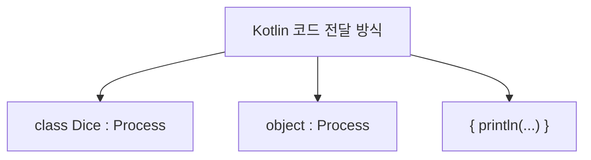

# 지역 클래스 / Lambda

## 🧠 Kotlin 지역 클래스 핵심 개념
- 정의 위치: 함수, 생성자, 블록 내부에서 선언
- 접근 범위:
- 자신의 필드
- 바깥 클래스의 인스턴스 변수
- 해당 블록의 지역 변수 및 매개변수 (val 또는 effectively final일 경우)
- 제한 사항:
- 접근 제어자 사용 불가
- static 선언 불가 (`Kotlin에는 static 키워드 없음`)

## ✅ Kotlin 지역 클래스 예제
```kotlin
class LocalOuter {
    private val outInstanceVar = 3

    fun process(paramVar: Int) {
        val localVar = 1

        class LocalPrinter {
            var value = 0
            fun printData() {
                println("value = $value")
                println("localVar = $localVar")
                println("paramVar = $paramVar")
                println("outInstanceVar = $outInstanceVar")
            }
        }

        val printer = LocalPrinter()
        printer.printData()
    }
}

fun main() {
    val outer = LocalOuter()
    outer.process(2)
}
```

## 🧾 실행 결과
```
value = 0
localVar = 1
paramVar = 2
outInstanceVar = 3
```


## 📦 지역 변수 캡처와 생명 주기
| 변수 종류       | 저장 위치   | 생존 범위                          | 지역 클래스에서 접근 가능 조건 |
|----------------|--------------|------------------------------------|-------------------------------|
| 클래스 변수     | 메서드 영역   | 프로그램 종료 시까지               | ✅ 가능                        |
| 인스턴스 변수   | 힙 영역       | 인스턴스가 GC 될 때까지            | ✅ 가능                        |
| 지역 변수       | 스택 영역     | 함수 종료 시 제거됨                | ✅ 가능 (`val` 또는 effectively final일 경우) |
| 매개변수        | 스택 영역     | 함수 종료 시 제거됨                | ✅ 가능 (`val` 또는 effectively final일 경우) |

- Kotlin도 지역 변수는 복사되어 캡처됨
- 지역 클래스 인스턴스는 힙에 존재 → 지역 변수보다 오래 생존

## 🔒 왜 val 또는 effectively final이어야 할까?
- 지역 변수의 값이 변경되면 캡처된 복사본과 불일치 발생
- Kotlin은 지역 클래스가 접근하는 지역 변수는 불변이어야 함
- 변경 가능하면 동기화 문제 발생 → 디버깅과 멀티스레드에서 위험

## 📌 Kotlin 지역 클래스 요약
| 항목                     | 설명                                                                 |
|--------------------------|----------------------------------------------------------------------|
| 정의 위치                | 함수, 생성자, 블록 내부에서 선언됨                                   |
| 접근 가능한 대상         | 자신의 필드, 바깥 클래스의 인스턴스 변수, 지역 변수 및 매개변수         |
| 지역 변수 접근 조건      | `val` 또는 effectively final일 경우만 접근 가능                        |
| 생명 주기 차이           | 지역 변수는 스택에 존재하며 함수 종료 시 제거됨, 지역 클래스 인스턴스는 힙에 존재하며 GC 전까지 생존 |
| 접근 제어자 사용 여부    | 지역 클래스는 접근 제어자 사용 불가                                   |
| 상속 및 인터페이스 구현 | 일반 클래스처럼 상속 및 인터페이스 구현 가능                           |


## 🧠 Kotlin 익명 클래스 핵심 개념
- 익명 클래스란?  
    이름 없이 클래스 선언과 인스턴스 생성을 동시에 수행하는 객체 표현식
- 사용 조건  
    반드시 인터페이스 구현 또는 클래스 상속이 필요함
- 문법 구조  
```kotlin
val ref = object : Type {
    // 구현 내용
}
```
- 생성자 정의 불가  
    이름이 없기 때문에 생성자 정의 불가, 기본 생성자만 사용됨
- 내부 이름 규칙  
    컴파일 시 OuterClass$1, OuterClass$2 등으로 내부 이름 부여됨 (JVM 기준)

## ✅ 지역 클래스 vs 익명 클래스 (Kotlin 기준)

| 항목               | 지역 클래스 (`class LocalPrinter`) | 익명 클래스 (`object : Interface`)     |
|--------------------|-------------------------------------|----------------------------------------|
| 클래스 선언 방식    | `class LocalPrinter`                | `object : Interface { ... }`           |
| 클래스 이름         | 있음 (`LocalPrinter`)              | 없음 (`Outer$1` 등으로 내부 생성됨)     |
| 선언과 생성         | 분리됨                              | 동시에 수행                             |
| 생성자 정의         | 가능                                | 불가능 (기본 생성자만 사용됨)          |
| 재사용성           | 여러 번 인스턴스 생성 가능         | 단일 인스턴스만 생성 가능              |
| 코드 간결성         | 상대적으로 복잡                    | 간결함                                 |
| 상속/구현 조건      | 선택적                              | 반드시 부모 클래스 상속 또는 인터페이스 구현 필요 |
| 내부 클래스 이름     | `Outer$1LocalPrinter` 등            | `Outer$1` 등                           |


## 📦 Kotlin 익명 클래스 예제
```kotlin
interface Printer {
    fun print()
}

class LocalOuterV2 {
    private val outInstanceVar = 3

    fun process(paramVar: Int) {
        val localVar = 1
        val printer = object : Printer {
            var value = 0
            override fun print() {
                println("value = $value")
                println("localVar = $localVar")
                println("paramVar = $paramVar")
                println("outInstanceVar = $outInstanceVar")
            }
        }
        printer.print()
        println("printer.class = ${printer::class}")
    }
}

fun main() {
    val outer = LocalOuterV2()
    outer.process(2)
}
```


## ✨ 익명 클래스의 장점
- 코드 간결성: 별도 클래스 정의 없이 즉석 구현 가능
- 일회성 로직 처리: 이벤트 핸들러, 콜백 등에서 유용
- 캡처 변수 접근 가능: 지역 변수, 매개변수, 바깥 클래스 멤버 접근 가능

## ⚠️ 익명 클래스의 한계
- 재사용 불가: 여러 번 인스턴스 생성이 필요한 경우 적합하지 않음
- 복잡한 로직에는 부적합: 코드 가독성 저하 가능
- 생성자 정의 불가: 초기화 로직이 제한됨

## 📌 Kotlin 익명 클래스 핵심 요약

| 항목               | 설명                                                                 |
|--------------------|----------------------------------------------------------------------|
| 클래스 이름         | 없음 (`Outer$1` 등으로 컴파일 시 내부 이름 부여됨)                   |
| 선언과 생성         | 동시에 수행 (`object : 인터페이스 { ... }`)                          |
| 생성자 정의         | 불가능 (기본 생성자만 사용됨)                                        |
| 상속/구현 조건      | 반드시 부모 클래스 상속 또는 인터페이스 구현 필요                     |
| 재사용성           | 단일 인스턴스만 생성 가능                                            |
| 캡처 변수 접근      | 지역 변수, 매개변수, 바깥 클래스 멤버 모두 접근 가능                   |
| 사용 목적           | 간단한 일회성 로직 처리, 이벤트 핸들러, 콜백 등                       |

---


# Lambda

## 📌 Kotlin 람다 핵심 요약
| 항목               | 설명                                                                 |
|--------------------|----------------------------------------------------------------------|
| 문법 형식           | `{ 실행 코드 }`, `(파라미터) -> 반환값`                              |
| 함수 타입           | `() -> Unit`, `(Int) -> String` 등                                   |
| 내부 구현 구조      | `FunctionN` 인터페이스 기반 (`Function0`, `Function1`, ...)          |
| 반환 가능           | 람다는 변수에 저장하거나 인자로 전달 가능                            |
| 활용 예시           | `map`, `filter`, `forEach` 등 고차 함수에서 자주 사용됨               |


## 🧠 Kotlin 중첩 클래스 및 람다 비교 요약

| 유형     | 선언 방식                         | 클래스 이름 여부 | 재사용성 / 간결성             |
|----------|-----------------------------------|------------------|-------------------------------|
| `class`  | `class Dice : Process { ... }`    | 있음             | ✅ 재사용 가능 / ❌ 코드 길다   |
| `object` | `object : Process { ... }`        | 없음             | ❌ 재사용 불가 / ✅ 간결함     |
| `lambda` | `{ println("...") }` 또는 `() -> Unit` | 없음             | ❌ 재사용 불가 / ✅ 가장 간결함 |





## ✅ 기본 람다 표현식 예제
```kotlin
val greet: () -> Unit = { println("Hello, Kotlin Lambda!") }
greet() // 출력: Hello, Kotlin Lambda!
```

- () -> Unit 타입의 람다
- 함수처럼 변수에 저장 후 호출

## ✅ 파라미터와 반환값이 있는 람다
```kotlin
val square: (Int) -> Int = { number -> number * number }
println(square(5)) // 출력: 25
```

- (Int) -> Int 타입
- 입력값을 받아 제곱한 결과 반환

## ✅ 고차 함수에 람다 전달
```kotlin
fun hello(process: () -> Unit) {
    println("프로그램 시작")
    process()
    println("프로그램 종료")
}

hello {
    println("주사위 = ${(1..6).random()}")
}
```

- hello는 () -> Unit 타입의 람다를 인자로 받음
- 람다를 통해 코드 조각을 전달

## ✅ 컬렉션 API에서 람다 활용
```kotlin
val numbers = listOf(1, 2, 3, 4, 5)
val doubled = numbers.map { it * 2 }
println(doubled) // 출력: [2, 4, 6, 8, 10]
```

- map은 (Int) -> Int 타입의 람다를 받음
- it은 암시적 파라미터

## ✅ 캡처 변수 사용 예제
```kotlin
fun makePrinter(prefix: String): () -> Unit {
    return { println("$prefix: ${System.currentTimeMillis()}") }
}

val printer = makePrinter("현재 시간")
printer() // 예: 현재 시간: 1708200000000
```

- 람다 내부에서 외부 변수 prefix를 캡처함
- 함수 종료 후에도 prefix는 람다 내부에서 유지됨

## ✅ 함수 타입을 인자로 받는 전략 패턴 예제
```kotlin
fun executeStrategy(strategy: (Int) -> String) {
    println(strategy(10))
}

executeStrategy { value ->
    if (value % 2 == 0) "짝수" else "홀수"
} // 출력: 짝수
```

- (Int) -> String 타입의 람다를 전략처럼 전달
- 조건에 따라 결과를 다르게 반환

---

# ✅ Kotlin 문제와 풀이 요약
## 문제 1: 정적 중첩 클래스 (Nested Class)
```kotlin
class OuterClass1 {
    class NestedClass {
        fun hello() {
            println("NestedClass.hello")
        }
    }
}
```

### 호출 방식:
```
val nested = OuterClass1.NestedClass()
nested.hello()
```


## 문제 2: 내부 클래스 (Inner Class)
```kotlin
class OuterClass2 {
    inner class InnerClass {
        fun hello() {
            println("InnerClass.hello")
        }
    }
}
```

### 호출 방식:
```kotlin
val outer = OuterClass2()
val inner = outer.InnerClass()
inner.hello()
```


## 문제 3: 지역 클래스 (Local Class)
```kotlin
fun myMethod() {
    class LocalClass {
        fun hello() {
            println("LocalClass.hello")
        }
    }
    val local = LocalClass()
    local.hello()
}
```


## 문제 4: 익명 클래스 (Anonymous Class)
```kotlin
interface Hello {
    fun hello()
}

fun main() {
    val hello = object : Hello {
        override fun hello() {
            println("Hello.hello")
        }
    }
    hello.hello()
}
```


## 📚 도서 관리 시스템 예제
```kotlin
class Library(size: Int) {
    private val books = arrayOfNulls<Book>(size)
    private var bookCount = 0

    fun addBook(title: String, author: String) {
        if (bookCount < books.size) {
            books[bookCount++] = Book(title, author)
        } else {
            println("도서관 저장 공간이 부족합니다.")
        }
    }

    fun showBooks() {
        println("== 책 목록 출력 ==")
        for (i in 0 until bookCount) {
            val book = books[i]
            println("도서 제목: ${book?.title}, 저자: ${book?.author}")
        }
    }

    private class Book(val title: String, val author: String)
}
```

### 도서 추가 및 출력:
```kotlin
val library = Library(3)
library.addBook("책1", "저자1")
library.showBooks()
```


## 📌 Kotlin 중첩 클래스 핵심 요약

| 클래스 유형       | 선언 위치       | 키워드/형식       | 바깥 인스턴스 필요 | 재사용성 | 특징 및 용도                           |
|------------------|----------------|-------------------|--------------------|-----------|----------------------------------------|
| 정적 중첩 클래스 | 클래스 내부     | `class`           | ❌ 필요 없음        | ✅ 가능    | 독립적 기능, 외부 노출 차단             |
| 내부 클래스       | 클래스 내부     | `inner class`     | ✅ 필요함           | ✅ 가능    | 바깥 인스턴스와 강하게 연관됨           |
| 지역 클래스       | 함수 내부       | `class`           | ✅ 필요함           | ❌ 불가    | 함수 내 일회성 로직, 지역 변수 접근 가능 |
| 익명 클래스       | 함수 내부       | `object : Type`   | ✅ 필요함           | ❌ 불가    | 이름 없이 즉시 구현, 이벤트/콜백에 적합  |
| 람다 표현식       | 함수 인자 위치  | `{ 실행 코드 }`   | ✅ 필요함           | ❌ 불가    | 함수형 타입 구현, 가장 간결한 코드 전달  |


---

## 📌 arrayOfNulls란?
- 정의: arrayOfNulls<T>(size: Int)는 null로 초기화된 T 타입 배열을 생성합니다.
- 용도: 배열의 각 요소를 나중에 채우거나, 초기값 없이 선언할 때 사용
- 반환 타입: Array<T?> — 즉, null을 포함할 수 있는 배열

## ✅ 사용 예제
```kotlin
val names = arrayOfNulls<String>(3)
names[0] = "Alice"
names[1] = "Bob"
names[2] = null

for (name in names) {
    println(name)
}
```

### 🟢 출력:
```
Alice
Bob
null
```


## 🔍 Kotlin arrayOfNulls 특징 요약

| 항목             | 설명                                               |
|------------------|----------------------------------------------------|
| 초기값           | 모든 요소가 `null`로 초기화됨                      |
| 반환 타입        | `Array<T?>` — null을 허용하는 T 타입 배열           |
| 생성 방식        | `arrayOfNulls(5)` — 크기만 지정, 값은 모두 null     |
| 용도             | 나중에 값을 채울 배열이 필요할 때                  |
| 대안             | `arrayOf()` — 초기값을 직접 지정할 때 사용         |


## ⚠️ 주의할 점
- arrayOfNulls<Int>(3)은 Array<Int?>를 생성합니다. 즉, 각 요소는 null 또는 Int가 될 수 있음.
- Kotlin은 기본적으로 null 안전성을 강조하므로, arrayOfNulls를 사용할 땐 null 처리 로직을 신경 써야 합니다.
