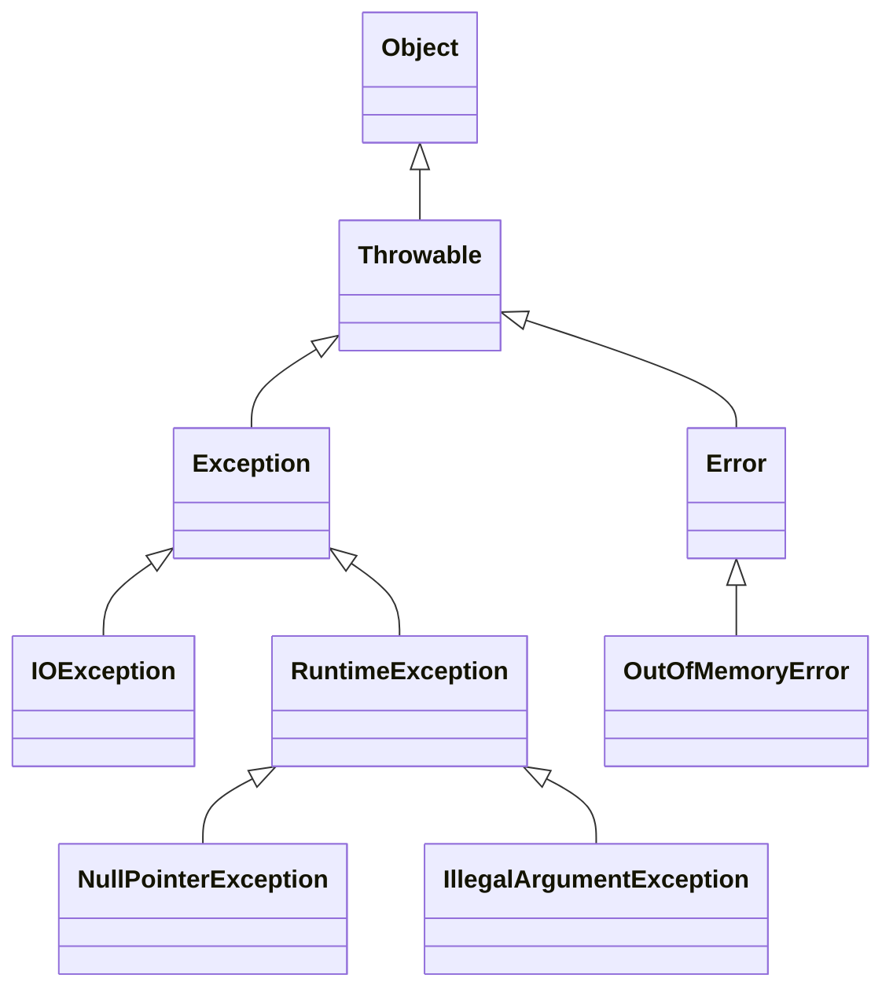
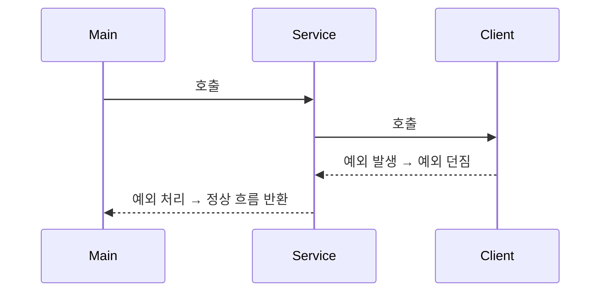
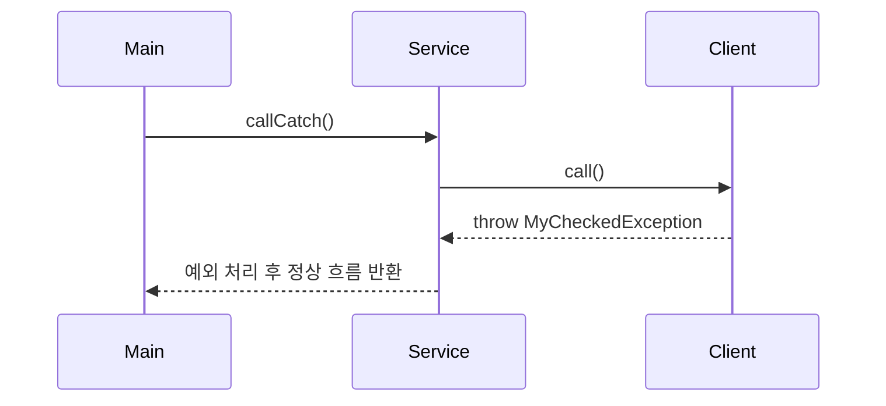
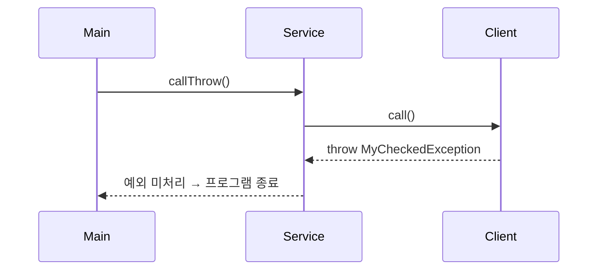

# ✅ Kotlin 예외 처리 버전

## 📦 NetworkClientV0.kt
```kotlin
class NetworkClientV0(private val address: String) {

    fun connect(): String {
        println("$address 서버 연결 성공")
        return "success"
    }

    fun send(data: String): String {
        println("$address 서버에 데이터 전송: $data")
        return "success"
    }

    fun disconnect() {
        println("$address 서버 연결 해제")
    }
}
```

## 📦 NetworkServiceV0.kt
```kotlin
class NetworkServiceV0 {

    fun sendMessage(data: String) {
        val address = "http://example.com"
        val client = NetworkClientV0(address)

        try {
            client.connect()
            client.send(data)
        } catch (e: Exception) {
            println("오류 발생: ${e.message}")
        } finally {
            client.disconnect()
        }
    }
}
```
- try-catch-finally 구조로 예외 발생 여부와 관계없이 disconnect()가 항상 호출됨
- Exception은 모든 예외를 포괄하며, 필요 시 세분화 가능

## 📦 MainV0.kt
```kotlin
fun main() {
    val networkService = NetworkServiceV0()

    while (true) {
        print("전송할 문자: ")
        val input = readlnOrNull() ?: continue
        if (input == "exit") break

        networkService.sendMessage(input)
        println()
    }

    println("프로그램을 정상 종료합니다.")
}
```

- Kotlin에서는 Scanner 대신 `readlnOrNull()` 을 사용해 입력을 받음
- null 입력 방지를 위해 `?:` continue로 처리

## ✅ 실행 예시
```
전송할 문자: hello
http://example.com 서버 연결 성공
http://example.com 서버에 데이터 전송: hello
http://example.com 서버 연결 해제

전송할 문자: exit
프로그램을 정상 종료합니다.
```

## 📌 Kotlin 예외 처리 핵심 요약
| 항목               | 설명                                                                 |
|--------------------|----------------------------------------------------------------------|
| 예외 처리 구조      | `try-catch-finally`, `runCatching` 등으로 안정성 확보 가능             |
| 자원 정리           | `finally` 블록에서 `disconnect()` 등 반드시 호출                      |
| 입력 처리           | `readlnOrNull()`로 안전하게 사용자 입력 받기                          |
| 기본 문법 요소      | `val`, `fun`, `class` 등 Kotlin의 간결하고 명확한 선언 방식 사용        |

---

# ✅ Kotlin 예외 처리 예제: 오류 유발 시나리오
## 📦 NetworkClientV1.kt
```kotlin
class NetworkClientV1(private val address: String) {
    var connectError: Boolean = false
    var sendError: Boolean = false

    fun connect(): String {
        return if (connectError) {
            println("$address 서버 연결 실패")
            "connectError"
        } else {
            println("$address 서버 연결 성공")
            "success"
        }
    }

    fun send(data: String): String {
        return if (sendError) {
            println("$address 서버에 데이터 전송 실패: $data")
            "sendError"
        } else {
            println("$address 서버에 데이터 전송: $data")
            "success"
        }
    }

    fun disconnect() {
        println("$address 서버 연결 해제")
    }

    fun initError(data: String) {
        if ("error1" in data) connectError = true
        if ("error2" in data) sendError = true
    }
}
```

## 📦 NetworkServiceV1_3.kt (개선된 흐름)
```kotlin
class NetworkServiceV1_3 {
    fun sendMessage(data: String) {
        val client = NetworkClientV1("http://example.com")
        client.initError(data)

        try {
            val connectResult = client.connect()
            if (isError(connectResult)) {
                println("[네트워크 오류 발생] 오류 코드: $connectResult")
                return
            }

            val sendResult = client.send(data)
            if (isError(sendResult)) {
                println("[네트워크 오류 발생] 오류 코드: $sendResult")
            }

        } catch (e: Exception) {
            println("[예외 발생] ${e.message}")
        } finally {
            client.disconnect()
        }
    }

    private fun isError(resultCode: String): Boolean = resultCode != "success"
}
```

- try-catch-finally로 예외 흐름과 자원 정리를 명확히 분리
- finally에서 항상 disconnect() 호출

## 📦 MainV1.kt
```kotlin
fun main() {
    val networkService = NetworkServiceV1_3()

    while (true) {
        print("전송할 문자: ")
        val input = readlnOrNull() ?: continue
        if (input == "exit") break

        networkService.sendMessage(input)
        println()
    }

    println("프로그램을 정상 종료합니다.")
}
```


## 📌 Kotlin 예외 처리 핵심 요약
| 항목                 | 설명                                                                 |
|----------------------|----------------------------------------------------------------------|
| `try-catch-finally`  | 예외 발생 가능 코드 감싸고, 오류 처리 및 자원 정리 보장               |
| `catch`              | 발생한 예외를 잡아 처리하며, 예외 객체로 상세 정보 확인 가능           |
| `finally` + `disconnect()` | 예외 발생 여부와 관계없이 항상 실행되어 자원 정리 수행               |
| `throw`              | 예외 객체를 명시적으로 발생시킬 때 사용                               |
| `runCatching` / `Result` | 함수형 스타일의 예외 처리. 성공/실패를 값으로 다루며 흐름 제어 가능     |

## 🔁 Kotlin 예외 흐름 요약
- Main → Service 호출
- Service → Client 호출
- Client에서 예외 발생
- Client는 예외를 Service로 던짐
- Service가 예외를 처리
- 정상 흐름으로 복귀

## 📌 Kotlin 예외 처리 기본 규칙

| 규칙 항목               | 설명                                                                 |
|--------------------------|----------------------------------------------------------------------|
| `try-catch-throw`        | 예외는 반드시 `try`로 감싸고 `catch`로 처리하거나 `throw`로 던져야 함 |
| `catch(e: Exception)`    | 부모 타입으로 예외를 처리하면 자식 예외도 함께 처리됨                 |


## 📊 Kotlin 예외 계층 구조 (Java와 동일)



## 🔄 Kotlin 예외 흐름 구조



## 🧠 Kotlin 예외 처리 방식 비교
| 항목               | 체크 예외 (IOException 등)             | 언체크 예외 (RuntimeException 등)         |
|--------------------|----------------------------------------|--------------------------------------------|
| 처리 방식          | `try-catch`, `throw`로 명시적 처리 필요 | `try-catch` 선택 가능, 생략해도 컴파일 가능 |
| `throws` 키워드    | Kotlin에서는 거의 사용하지 않음          | 선언하지 않아도 자동으로 전파됨             |
| 대표 예외 유형      | `IOException`, `FileNotFoundException`  | `NullPointerException`, `IllegalArgumentException` |
| 컴파일러 체크 여부 | ❌ Kotlin은 체크 예외를 강제하지 않음     | ❌ 동일                                     |


## ✅ Kotlin 주요 키워드 정리
| 키워드        | 설명 또는 예시                                      |
|---------------|-----------------------------------------------------|
| `throw`       | 예외 객체를 직접 발생시킬 때 사용 (`throw IOException("fail")`) |
| `try`         | 예외 발생 가능성이 있는 코드를 감싸는 블록               |
| `catch`       | 발생한 예외를 잡아서 처리하는 블록 (`catch(e: Exception)`) |
| `finally`     | 예외 발생 여부와 관계없이 항상 실행되는 블록 (자원 정리 등) |
| `runCatching` | 함수형 스타일 예외 처리. 결과를 `Result`로 반환          |
| `Result`      | 성공/실패를 값으로 표현하는 타입. `isSuccess`, `isFailure` 등 사용 가능 |


## 📦 Kotlin 예외 흐름 예제
### 예외를 잡아서 처리하는 흐름
```kotlin
try {
    client.call() // 예외 발생
} catch (e: MyCheckedException) {
    println("예외 처리: ${e.message}")
}
println("정상 흐름")
```

### 예외를 던지는 흐름
```kotlin
fun callThrow() {
    throw MyCheckedException("예외 발생") // 호출한 쪽에서 처리 필요
}
```


## 📊 사용자 정의 예외 클래스
```kotlin
class MyCheckedException(message: String) : Exception(message)
class MyUncheckedException(message: String) : RuntimeException(message)
```


## 🔁 예외 흐름 시퀀스
### 예외를 잡아서 처리하는 흐름


### 예외를 던지고 처리하지 않는 흐름



## 📌 Kotlin 예외 처리 전략 요약

| 전략 항목           | 설명                                                                 |
|----------------------|----------------------------------------------------------------------|
| `runCatching` / `Result` | 함수형 스타일 예외 처리. 성공/실패를 값으로 다루며 흐름 제어 가능         |
| `finally`            | 예외 발생 여부와 관계없이 항상 실행되어 자원 정리 보장                   |
| `RuntimeException`   | 언체크 예외로 처리. 불필요한 예외 강제 처리 없이 유연한 흐름 유지 가능     |


## 📌 Kotlin 언체크 예외의 장단점

| 항목             | 장점                                                                 | 단점                                                                 | 비고                         |
|------------------|----------------------------------------------------------------------|----------------------------------------------------------------------|------------------------------|
| `throws` 선언     | 생략 가능 → 코드 간결함                                               | 예외 발생 여부를 파악하기 어려움                                     | 선언은 선택 사항             |
| 예외 처리 강제성  | 컴파일러가 강제하지 않음 → 자유로운 설계 가능                         | 실수로 예외를 놓칠 수 있어 안정성 저하 가능성 있음                    | IDE 도움으로 보완 가능       |
| 코드 가독성       | 핵심 로직에 집중 가능                                                | 예외 흐름이 명확히 드러나지 않아 유지보수 시 혼란 가능                | 중요한 예외는 명시적 처리 권장 |
| 실무 적용 전략    | 단순 예외는 무시하거나 `RuntimeException`으로 처리 가능               | 복잡한 예외는 명시적으로 처리하지 않으면 디버깅 어려움                | 의미 있는 예외는 `runCatching` 등으로 처리 |


## 🧩 Kotlin 예외 처리 최종 정리
- Kotlin은 Java와 달리 체크 예외를 강제하지 않음
- 예외는 try-catch로 잡거나 throw로 던질 수 있음
- throws 선언은 거의 사용되지 않으며, 예외는 런타임에 전파됨
- 실무에서는 복잡한 예외는 명시적으로 처리하고, 단순한 예외는 RuntimeException 기반으로 처리하는 전략이 일반적

## ✅ Kotlin 예외 클래스 정의 예시
### 사용자 정의 언체크 예외
```kotlin
class MyUncheckedException(message: String) : RuntimeException(message)
```

### 예외 발생
```kotlin
fun call() {
    throw MyUncheckedException("이름은 null일 수 없습니다.")
}
```

### 예외 처리
```kotlin
try {
    call()
} catch (e: MyUncheckedException) {
    println("❗ 예외 처리: ${e.message}")
}

```

## 📦 Kotlin 예외 핸들링 프레임워크 설계 예시
### 1. 예외 핸들러 인터페이스
```kotlin
fun interface ExceptionHandler<T : Throwable> {
    fun handle(exception: T)
}
```

### 2. 예외 처리기 등록소
```kotlin
class ExceptionResolver {
    private val handlers = mutableMapOf<Class<out Throwable>, ExceptionHandler<out Throwable>>()

    fun <T : Throwable> registerHandler(type: Class<T>, handler: ExceptionHandler<T>) {
        handlers[type] = handler
    }

    fun resolve(ex: Throwable) {
        val handler = handlers[ex::class.java]
        if (handler != null) {
            @Suppress("UNCHECKED_CAST")
            (handler as ExceptionHandler<Throwable>).handle(ex)
        } else {
            println("Unhandled exception: ${ex.message}")
            ex.printStackTrace()
        }
    }
}
```

### 3. 사용자 정의 핸들러 등록
```kotlin
class IllegalArgumentHandler : ExceptionHandler<IllegalArgumentException> {
    override fun handle(exception: IllegalArgumentException) {
        println("❗ 잘못된 인자: ${exception.message}")
    }
}
```

### 4. 실행 예제
```kotlin
fun main() {
    val resolver = ExceptionResolver()
    resolver.registerHandler(IllegalArgumentException::class.java, IllegalArgumentHandler())

    try {
        process()
    } catch (ex: Throwable) {
        resolver.resolve(ex)
    }
}

fun process() {
    throw IllegalArgumentException("이름은 null일 수 없습니다.")
}
```

### 🧠 출력 결과:
```
❗ 잘못된 인자: 이름은 null일 수 없습니다.
```


---

# Java 와 Kotlin 예외 처일 방식 차이

아래는 Java와 Kotlin의 예외 처리 방식 핵심 비교표입니다.  
두 언어 모두 JVM 기반이지만, 예외 처리 철학과 문법에서 중요한 차이가 있음.

## 📌 Java vs Kotlin 예외 처리 비교
| 항목                         | Java                                                  | Kotlin                                                  |
|------------------------------|-------------------------------------------------------|----------------------------------------------------------|
| 예외 선언 (`throws`)         | Checked 예외는 반드시 `throws` 선언 필요              | 거의 사용하지 않음. 선언은 선택 사항                     |
| 예외 처리 문법               | `try-catch-finally`, `throw`, `throws`                | `try-catch-finally`, `throw`, `runCatching`, `Result`    |
| 함수형 예외 처리             | 없음                                                  | `runCatching`으로 예외를 값처럼 처리 가능 (`Result`)      |
| 자원 정리 방식               | `finally`, `try-with-resources`                       | `finally`, `use` 확장 함수로 자동 자원 정리               |
| 예외 캐치 방식               | `catch(Exception)`                                    | `catch(e: Exception)`                                    |
| 사용자 정의 예외 클래스      | `extends Exception`, `RuntimeException`               | `class MyException : Exception()`, `RuntimeException()`  |


## ✅ Kotlin만의 예외 처리 기능
| 기능 항목           | 설명 또는 예시                                                              |
|----------------------|---------------------------------------------------------------------------|
| `runCatching`        | 예외를 `Result`로 감싸서 성공/실패를 값으로 처리 (`runCatching { ... }`)     |
| `Result`             | `isSuccess`, `isFailure`, `getOrNull()`, `exceptionOrNull()` 등으로 상태 확인 가능 |
| `use`                | 자원 자동 정리. `InputStream().use { ... }` 형태로 `finally` 없이 안전하게 처리 |
| `Throwable.message`  | 예외 메시지 접근 방식 동일 (`e.message`)                                     |


## ✨ Java vs Kotlin 실무 적용 전략
| 상황                         | Java 방식                                 | Kotlin 방식                                      |
|------------------------------|-------------------------------------------|--------------------------------------------------|
| 외부 자원 접근 (파일, DB 등) | `try-catch`                                | `try-catch` 또는 `runCatching`                   |
| 인자 검증                    | `IllegalArgumentException` 수동 발생       | `require()`, `check()`, `IllegalArgumentException` 자동화 |
| 비동기 흐름 제어             | `try-catch` + `CompletableFuture`          | `runCatching`, `CoroutineExceptionHandler`       |

---

# try-catch 선택 사항

Kotlin에서는 예외 처리(try-catch)가 선택 사항입니다.  
자바와 달리 Kotlin은 모든 예외를 언체크(Unchecked) 예외로 간주하기 때문에, 컴파일러가 try-catch나 throws를 강제하지 않음.

## ✅ Kotlin에서 예외 처리 선택 가능한 이유
- Kotlin은 Checked Exception을 지원하지 않음
- 자바에서는 IOException, SQLException 같은 예외는 반드시 처리하거나 던져야 함
- Kotlin에서는 이런 예외도 그냥 throw만 하면 되고, throws 선언도 생략 가능
- 예외가 발생해도 컴파일러가 경고하지 않음
- 예외를 처리하지 않아도 컴파일은 정상적으로 완료됨
- 대신 런타임에서 예외가 발생하면 앱이 종료될 수 있음

## ✨ 실무에서의 처리 전략 (Kotlin)
| 상황                     | 처리 방식 예시                                      |
|--------------------------|-----------------------------------------------------|
| 예외 발생 가능 코드       | `try-catch` 또는 `runCatching`으로 흐름 제어         |
| 인자 유효성 검사         | `require()`, `check()`로 사전 조건 명시               |
| 자원 자동 정리           | `use` 확장 함수 사용 (`InputStream().use { ... }`)    |
| 비동기 예외 처리         | `CoroutineExceptionHandler`, `runCatching` 활용       |


## 📌 예시: 처리하지 않아도 컴파일 되는 코드
```kotlin
fun readFile() {
    val file = File("not_exist.txt")
    file.readText() // IOException 발생 가능
}
```

- 위 코드는 IOException을 처리하지 않아도 컴파일됨
- 하지만 파일이 없으면 런타임에서 예외 발생 → 앱 종료


---

# runCatching

## ✅ Kotlin runCatching 개념 정리

| 항목               | 설명 또는 예시                                                              |
|--------------------|---------------------------------------------------------------------------|
| `runCatching`      | 예외 발생 가능 코드 블록을 실행하고 `Result` 객체로 감싸서 반환              |
| `Result`           | 성공/실패 여부를 담는 타입. `runCatching`의 반환값                          |
| `Result<T>`        | 제네릭 타입으로 성공 시 결과값을 포함 (`T`는 반환 타입)                      |
| 주요 메서드        | `isSuccess`, `isFailure`, `getOrNull()`, `exceptionOrNull()` 등으로 상태 확인 가능 |


## ✨ 기본 사용 예제
```kotlin
fun riskyOperation(): String {
    if (Math.random() > 0.5) {
        throw IllegalStateException("실패 발생!")
    }
    return "성공 결과"
}

fun main() {
    val result = runCatching { riskyOperation() }

    if (result.isSuccess) {
        println("✅ 성공: ${result.getOrNull()}")
    } else {
        println("❌ 실패: ${result.exceptionOrNull()?.message}")
    }
}
```


## 🔄 체이닝 활용 예제
```kotlin
val message = runCatching { "Hello".substring(10) }
    .recover { "기본값" } // 실패 시 대체 값
    .getOrNull()

println(message) // → "기본값"
```


## 🧠 고급 예제: 파일 읽기
```kotlin
fun readFile(path: String): String =
    runCatching {
        File(path).readText()
    }.getOrElse {
        "파일 읽기 실패: ${it.message}"
    }

```

## 📌 실무 팁
- runCatching은 코루틴에서도 잘 작동함
- Result는 return 값으로도 활용 가능 → 함수형 API 설계에 적합
- 실패 시 recover, getOrElse, onFailure 등으로 유연하게 대응 가능

---
