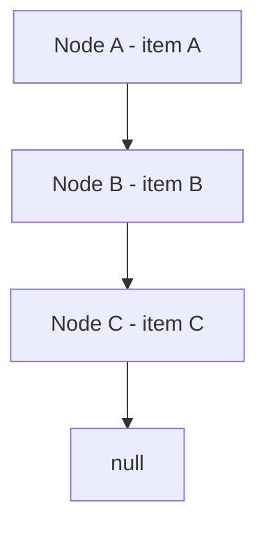
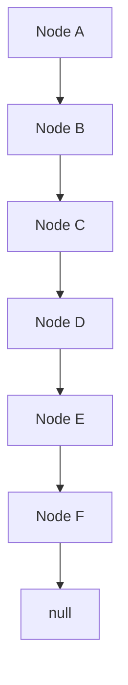
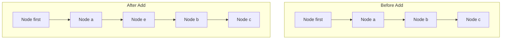
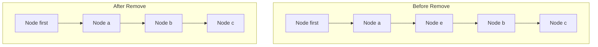

# 🔗 LinkedList 도입

## 📦 배열 리스트의 단점
- 공간 낭비: 배열은 크기를 미리 정해야 하며, 사용하지 않는 공간이 생길 수 있음
- 중간 삽입/삭제 비효율: 중간에 데이터를 삽입하거나 삭제할 때 많은 요소를 이동시켜야 함

## 🔗 연결 리스트의 구조
- 각 노드는 item과 next 필드를 가짐
- next는 다음 노드를 참조함
- 필요할 때마다 노드를 생성하고 연결함

## 🧱 Node 클래스
```kotlin
class Node(var item: Any) {
    var next: Node? = null

    override fun toString(): String {
        val sb = StringBuilder("[")
        var x: Node? = this
        while (x != null) {
            sb.append(x.item)
            if (x.next != null) sb.append("->")
            x = x.next
        }
        sb.append("]")
        return sb.toString()
    }
}

```


## 🧪 사용 예시
```kotline
fun main() {
    val first = Node("A")
    first.next = Node("B")
    first.next?.next = Node("C")

    var x: Node? = first
    while (x != null) {
        println(x.item)
        x = x.next
    }

    println("전체 구조: $first") // 출력: [A->B->C]
}
```


### 🖨️ 출력 결과
```
A
B
C
```


## 🧠 연결 구조 시각화



## 🧪 toString()으로 연결 구조 출력
```java
println(first) // [A->B->C]

```

## 🧪 기능 확장
### 기능 목록
- 모든 노드 탐색
- 마지막 노드 조회
- 특정 인덱스 노드 조회
- 노드 추가
```java
add(first, "D");
add(first, "E");
add(first, "F");
println(first); // [A->B->C->D->E->F]
```

```kotlin
fun printAll(node: Node) {
    var x: Node? = node
    while (x != null) {
        println(x.item)
        x = x.next
    }
}

fun getLastNode(node: Node): Node {
    var x: Node = node
    while (x.next != null) {
        x = x.next!!
    }
    return x
}

fun getNode(node: Node, index: Int): Node {
    var x: Node? = node
    repeat(index) {
        x = x?.next
    }
    return x ?: throw IndexOutOfBoundsException()
}

fun add(node: Node, param: String) {
    val lastNode = getLastNode(node)
    lastNode.next = Node(param)
}

```
## 🧠 전체 연결 구조 시각화



## 🧠 연결 리스트 핵심 구조
- 각 노드는 item과 next를 가짐
- next는 다음 노드를 참조
- 인덱스는 연결 순서를 기준으로 가정 (실제 존재하지 않음)

### MyLinkedListV1 클래스
```kotlin
class MyLinkedListV1 {
    private var first: Node? = null
    private var size = 0

    fun add(e: Any) {
        val newNode = Node(e)
        if (first == null) {
            first = newNode
        } else {
            val lastNode = getLastNode()
            lastNode?.next = newNode
        }
        size++
    }

    private fun getLastNode(): Node? {
        var x = first
        while (x?.next != null) {
            x = x.next
        }
        return x
    }

    fun set(index: Int, element: Any): Any {
        val x = getNode(index) ?: throw IndexOutOfBoundsException()
        val oldValue = x.item
        x.item = element
        return oldValue
    }

    fun get(index: Int): Any {
        return getNode(index)?.item ?: throw IndexOutOfBoundsException()
    }

    private fun getNode(index: Int): Node? {
        var x = first
        repeat(index) {
            x = x?.next
        }
        return x
    }

    fun indexOf(o: Any): Int {
        var index = 0
        var x = first
        while (x != null) {
            if (x.item == o) return index
            x = x.next
            index++
        }
        return -1
    }

    fun size(): Int = size

    override fun toString(): String {
        return "MyLinkedListV1{first=$first, size=$size}"
    }

    private class Node(var item: Any) {
        var next: Node? = null

        override fun toString(): String {
            val sb = StringBuilder("[")
            var temp: Node? = this
            while (temp != null) {
                sb.append(temp.item)
                if (temp.next != null) sb.append("->")
                temp = temp.next
            }
            sb.append("]")
            return sb.toString()
        }
    }
}
```


### 🧪 주요 기능 설명

| 메서드                      | 기능 설명                                      | 반환값 예시 또는 동작     | 시간 복잡도 |
|-----------------------------|-----------------------------------------------|----------------------------|--------------|
| `add(e: Any)`               | 마지막 노드 뒤에 새 노드를 추가               | `add("a")` → [a]           | O(n)         |
| `get(index: Int)`           | 특정 위치의 데이터를 반환                     | `get(1)` → "b"             | O(n)         |
| `set(index: Int, element: Any)` | 특정 위치의 데이터를 변경하고 기존 값 반환 | `set(2, "z")` → "c"        | O(n)         |
| `indexOf(o: Any)`           | 특정 데이터를 검색하고 인덱스 반환            | `indexOf("c")` → 2         | O(n)         |
| `size()`                    | 리스트의 현재 크기 반환                       | `size()` → 3               | O(1)         |

### 📈 실행 예시
```java
list.add("a"); // [a]
list.add("b"); // [a->b]
list.add("c"); // [a->b->c]
list.set(2, "z"); // [a->b->z]
list.add("d"); // [a->b->z->d]
list.add("e"); // [a->b->z->d->e]
list.add("f"); // [a->b->z->d->e->f]
```

### 출력 결과
```

==데이터 추가==
MyLinkedListV1{first=null, size=0}
MyLinkedListV1{first=[a], size=1}
MyLinkedListV1{first=[a->b], size=2}
MyLinkedListV1{first=[a->b->c], size=3}

==기능 사용==
list.size(): 3
list.get(1): b
list.indexOf('c'): 2
list.set(2, 'z'), oldValue: c
MyLinkedListV1{first=[a->b->z], size=3}

==범위 초과==
MyLinkedListV1{first=[a->b->z->d], size=4}
MyLinkedListV1{first=[a->b->z->d->e], size=5}
MyLinkedListV1{first=[a->b->z->d->e->f], size=6}
```


### 📌 연결 리스트 vs 배열 리스트

| 항목               | ArrayList                          | LinkedList                          |
|--------------------|------------------------------------|--------------------------------------|
| 내부 구조          | 배열 기반 (동적 배열)              | 노드 기반 (참조로 연결된 구조)       |
| 메모리 사용        | 고정 크기 확보 → 공간 낭비 가능   | 필요한 만큼만 동적 생성 → 효율적     |
| 인덱스 접근 속도   | 빠름 (O(1))                        | 느림 (O(n))                          |
| 중간 삽입/삭제     | 느림 (요소 이동 필요)             | 빠름 (참조만 변경)                   |
| 마지막 요소 추가   | 빠름 (O(1))                        | 느림 (마지막 노드 탐색 필요 → O(n)) |
| 검색               | 빠름 (O(n), 캐시 활용 가능)       | 느림 (O(n))                          |
| 메모리 오버헤드    | 적음                               | 노드마다 참조 필드 필요 → 오버헤드 있음 |
| 사용 용도          | 읽기/검색 중심 작업에 적합        | 삽입/삭제 중심 작업에 적합           |

---

## 연결 리스트에서의 인덱스란?
- 연결 리스트는 배열처럼 실제 인덱스가 존재하지 않음
- 노드의 연결 순서를 기준으로 인덱스를 가정함
- 예: 첫 번째 노드 → index 0, 두 번째 노드 → index 1 …


## ✚ 데이터 추가 기능: add(int index, Object e)
### 1️⃣ 첫 번째 위치에 추가 (index == 0)
- 기존 리스트: [a->b->c]
- 추가 후: [d->a->b->c]
#### 처리 순서
- 신규 노드 생성 (newNode)
- newNode.next = first
- first = newNode
#### 시간 복잡도
- O(1) → 매우 빠름 (참조만 변경)

### 2️⃣ 중간 위치에 추가 (index > 0)
- 기존 리스트: [a->b->c]
- 추가 후 (index 1): [a->e->b->c]
#### 처리 순서
- prev = getNode(index - 1)
- newNode.next = prev.next
- prev.next = newNode
#### 시간 복잡도
- O(n) → 위치 탐색 O(n) + 연결 O(1)

## ❌ 데이터 삭제 기능: remove(int index)
### 1️⃣ 첫 번째 위치 삭제 (index == 0)
- 기존 리스트: [d->a->b->c]
- 삭제 후: [a->b->c]
#### 처리 순서
- removeNode = first
- first = removeNode.next
- removeNode.item = null, removeNode.next = null
#### 시간 복잡도
- O(1) → 매우 빠름

### 2️⃣ 중간 위치 삭제 (index > 0)
- 기존 리스트: [a->e->b->c]
- 삭제 후 (index 1): [a->b->c]
#### 처리 순서
- prev = getNode(index - 1)
- removeNode = prev.next
- prev.next = removeNode.next
- removeNode.item = null, removeNode.next = null
#### 시간 복잡도
- O(n) → 위치 탐색 O(n) + 연결 O(1)

### ✚ 삽입/삭제 기능 요약

| 연산               | 처리 순서 요약                                 | 설명                         | 시간 복잡도 |
|--------------------|------------------------------------------------|------------------------------|--------------|
| `add(0, e)`        | `newNode.next = first` → `first = newNode`     | 맨 앞에 노드 삽입            | O(1)         |
| `add(index, e)`    | `prev = getNode(index - 1)` → 연결 수행        | 중간 위치에 노드 삽입        | O(n)         |
| `remove(0)`        | `first = first.next`                           | 맨 앞 노드 제거              | O(1)         |
| `remove(index)`    | `prev.next = removeNode.next`                  | 중간 위치 노드 제거          | O(n)         |


### 📊 성능 비교 요약

| 연산                  | ArrayList 성능 | LinkedList 성능 | 설명                                       |
|-----------------------|----------------|------------------|--------------------------------------------|
| `get(index)`          | O(1)           | O(n)             | 배열은 인덱스로 즉시 접근 가능             |
| `add(e)`              | O(1)           | O(n)             | LinkedList는 마지막 노드 탐색 필요         |
| `add(index, e)`       | O(n)           | O(n)             | 위치 탐색 후 삽입                          |
| `remove(index)`       | O(n)           | O(n)             | 위치 탐색 후 삭제                          |
| `add/remove at front` | O(n)           | O(1)             | LinkedList는 참조만 변경하면 됨            |
| `forEach`             | O(n)           | O(n)             | 전체 순회는 동일                          |


## 🔍 구조 변화 시각화 (Mermaid)
### 첫 번째 위치에 "d" 추가


### 첫 번째 노드 "d" 삭제
graph TD
```mermaid
    subgraph Before Remove
        D[Node d] --> A[Node a]
        A --> B[Node b]
        B --> C[Node c]
        Start[Node first] --> D
    end

    subgraph After Remove
        A2[Node a] --> B2[Node b]
        B2 --> C2[Node c]
        Start2[Node first] --> A2
    end
```

### 중간 위치 "e" 추가


### 중간 위치 "e" 삭제



## 🔁 확장 방향
### ✅ 이중 연결 리스트
```kotlin
public class Node {
    Object item;
    Node next; // 다음 노드
    Node prev; // 이전 노드
}
```

- 양방향 탐색 가능
- 삭제 시 이전 노드 참조로 더 빠름
### ✅ 마지막 노드 참조 추가
```kotlin
public class LinkedList {
    private Node first;
    private Node last; // 마지막 노드 참조
    private int size = 0;
}
```

- 마지막 노드에 직접 접근 가능 → 뒤쪽 삽입/삭제 O(1)

## 🧠 결론
- 앞쪽 삽입/삭제가 많다면 → 연결 리스트가 유리
- 조회/검색이 많고, 뒤쪽 삽입이 많다면 → 배열 리스트가 유리
- 자바의 LinkedList는 이중 연결 리스트 + 마지막 노드 참조로 성능 최적화됨


## 🧠 핵심 개념 요약 (Kotlin 버전)
### ✅ 제네릭 도입 (<E>)
- Any 대신 타입 매개변수 <E> 사용
- 컴파일 시점에 타입 체크 가능 → 타입 안정성 확보
- 다양한 타입의 리스트를 하나의 클래스 구조로 처리 가능
### ✅ 중첩 클래스 사용 (private class Node<E>)
- Node는 리스트 내부에서만 사용되므로 외부 노출 불필요
- MyLinkedListV3 내부에 Node를 중첩 클래스로 선언
- 구조적으로 깔끔하고 캡슐화 효과

### 🔧 주요 기능 정리

| 메서드                      | 기능 설명                                      | 반환 타입 | 시간 복잡도 |
|-----------------------------|-----------------------------------------------|------------|--------------|
| `add(e: E)`                 | 마지막 노드 뒤에 새 노드 추가                 | `Unit`     | O(n)         |
| `add(index: Int, e: E)`     | 특정 위치에 새 노드 삽입                     | `Unit`     | O(n)         |
| `remove(index: Int)`        | 특정 위치의 노드 제거                         | `E`        | O(n)         |
| `get(index: Int)`           | 특정 위치의 데이터 조회                       | `E`        | O(n)         |
| `set(index: Int, e: E)`     | 특정 위치의 데이터 변경 후 기존 값 반환      | `E`        | O(n)         |
| `indexOf(o: E)`             | 특정 데이터를 검색하고 인덱스 반환            | `Int`      | O(n)         |
| `size()`                    | 현재 리스트 크기 반환                         | `Int`      | O(1)         |


### 🧪 소스 코드
```kotlin
class MyLinkedListV3<E> {
    private var first: Node<E>? = null
    private var size = 0

    fun add(e: E) {
        val newNode = Node(e)
        if (first == null) {
            first = newNode
        } else {
            getLastNode()?.next = newNode
        }
        size++
    }

    fun add(index: Int, e: E) {
        val newNode = Node(e)
        if (index == 0) {
            newNode.next = first
            first = newNode
        } else {
            val prev = getNode(index - 1)
            newNode.next = prev?.next
            prev?.next = newNode
        }
        size++
    }

    fun set(index: Int, element: E): E {
        val node = getNode(index) ?: throw IndexOutOfBoundsException()
        val oldValue = node.item
        node.item = element
        return oldValue!!
    }

    fun remove(index: Int): E {
        val removeNode = getNode(index) ?: throw IndexOutOfBoundsException()
        val removedItem = removeNode.item
        if (index == 0) {
            first = removeNode.next
        } else {
            val prev = getNode(index - 1)
            prev?.next = removeNode.next
        }
        removeNode.item = null
        removeNode.next = null
        size--
        return removedItem!!
    }

    fun get(index: Int): E {
        return getNode(index)?.item ?: throw IndexOutOfBoundsException()
    }

    fun indexOf(o: E): Int {
        var index = 0
        var x = first
        while (x != null) {
            if (x.item == o) return index
            x = x.next
            index++
        }
        return -1
    }

    fun size(): Int = size

    override fun toString(): String {
        return "MyLinkedListV3{first=${first}, size=$size}"
    }

    private fun getLastNode(): Node<E>? {
        var x = first
        while (x?.next != null) {
            x = x.next
        }
        return x
    }

    private fun getNode(index: Int): Node<E>? {
        var x = first
        repeat(index) {
            x = x?.next
        }
        return x
    }

    private class Node<E>(var item: E?) {
        var next: Node<E>? = null

        override fun toString(): String {
            val sb = StringBuilder("[")
            var temp: Node<E>? = this
            while (temp != null) {
                sb.append(temp.item)
                if (temp.next != null) sb.append("->")
                temp = temp.next
            }
            sb.append("]")
            return sb.toString()
        }
    }
}

```

### 🧪 실행 예시
```kotlin
fun main() {
    val stringList = MyLinkedListV3<String>()
    stringList.add("a")
    stringList.add("b")
    stringList.add("c")
    println("string = ${stringList.get(0)}") // string = a

    val intList = MyLinkedListV3<Int>()
    intList.add(1)
    intList.add(2)
    intList.add(3)
    println("integer = ${intList.get(0)}") // integer = 1
}
```


## 📌 장점 요약

| 요소            | 설명 또는 효과                                           |
|-----------------|----------------------------------------------------------|
| `<E>`           | 제네릭 도입으로 타입 안정성 확보, 형변환 불필요          |
| `Node<E>`       | 중첩 클래스로 외부 노출 방지, 구조적 캡슐화              |
| 타입별 인스턴스 | `MyLinkedListV3<String>`, `MyLinkedListV3<Int>` 등 다양한 타입 지원 |
| 출력 구조       | `[a->b->c]` 형식으로 연결 상태 직관적으로 확인 가능      |

## 🧠 결론
- MyLinkedListV3는 Kotlin에서도 타입 안정성과 구조적 명확성을 갖춘 사용자 정의 연결 리스트
- 자바의 컬렉션 프레임워크처럼 제네릭 기반 자료구조를 직접 구현한 좋은 예시
- 중첩 클래스를 통해 내부 전용 구조를 은닉하고, 유지보수성과 가독성을 높임

---

