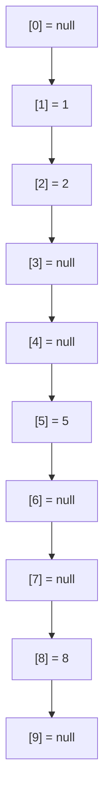
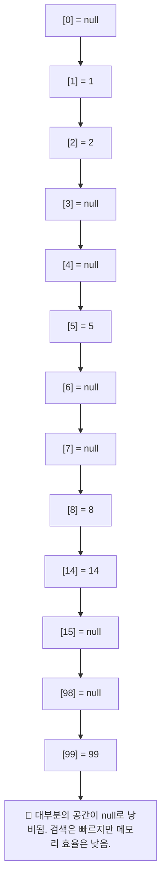
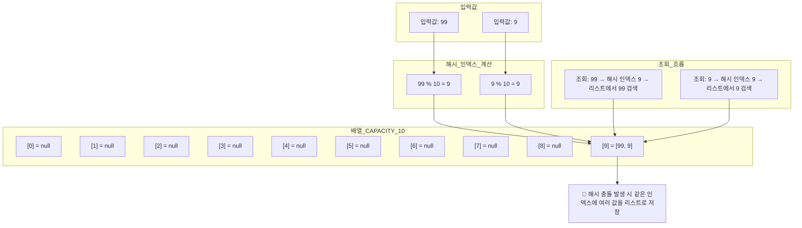
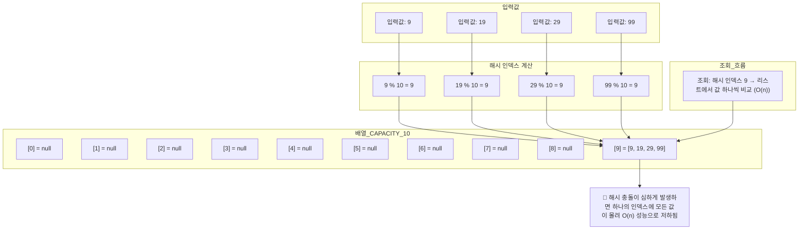

# Set 구조 이해
## 📚 List vs Set 자료구조 비교

| 항목         | List (리스트)             | Set (HashSet)                  |
|--------------|---------------------------|--------------------------------|
| 정의         | 순차적 요소의 컬렉션      | 중복 없는 유일한 요소의 집합  |
| 순서         | 요소 추가 순서 유지       | 일반적으로 순서 없음          |
| 중복         | 허용됨                    | 허용되지 않음                  |
| 접근 방식     | list[0]                   | set.contains(x)                |
| 주요 메서드   | get(index), add(value)    | add(value), contains(value)    |
| 용도         | 순서 + 중복 허용 필요 시  | 고유값 저장 + 빠른 검색 필요 시 |
| 예시         | 장바구니, 이벤트 로그     | 회원 ID, 고유 태그 집합        |


## 🛠 직접 구현한 Set
### ✅ 핵심 기능
- add(value: Int): 중복 없이 값 추가
- contains(value: Int): 값 존재 여부 확인
- toString(): 현재 저장된 요소 출력
  
### 📦 코드 예시
```kotlin
package collection.set

class MyHashSetV0 {
    private val elementData = IntArray(10)
    private var size = 0

    // O(n)
    fun add(value: Int): Boolean {
        if (contains(value)) return false
        elementData[size] = value
        size++
        return true
    }

    // O(n)
    fun contains(value: Int): Boolean {
        for (i in 0 until size) {
            if (elementData[i] == value) return true
        }
        return false
    }

    fun getSize(): Int = size

    override fun toString(): String {
        val data = elementData.copyOf(size).joinToString(", ")
        return "MyHashSetV0(elementData=[$data], size=$size)"
    }
}
```


### ▶️ 실행 예시
```kotlin
package collection.set

fun main() {
    val set = MyHashSetV0()
    set.add(1)
    set.add(2)
    set.add(3)
    set.add(4)
    println(set)

    val result = set.add(4) // 중복 데이터 저장
    println("중복 데이터 저장 결과 = $result")
    println(set)

    println("set.contains(3): ${set.contains(3)}") // true
    println("set.contains(99): ${set.contains(99)}") // false
}
```


### 🧪 실행 결과
```
MyHashSetV0(elementData=[1, 2, 3, 4], size=4)
중복 데이터 저장 결과 = false
MyHashSetV0(elementData=[1, 2, 3, 4], size=4)
set.contains(3): true
set.contains(99): false
```


## 📊 성능 분석
| 기능             | 시간 복잡도 | 설명                                               |
|------------------|--------------|----------------------------------------------------|
| add(value)       | O(n)         | 중복 확인을 위해 전체 배열을 순회해야 함           |
| contains(value)  | O(n)         | 배열 전체를 탐색하며 값 존재 여부를 확인           |
| 저장 구조        | 배열         | 고정 크기 배열 사용, 크기 초과 시 확장 불가        |
| 확장성           | 낮음         | 배열 크기 제한으로 인해 대량 데이터 처리에 부적합  |


## 🧠 정리 및 개선 방향
- 현재 구현은 단순하지만 성능이 좋지 않음 (특히 add()가 O(n))
- 중복 확인이 전체 순회 방식이라 데이터가 많을수록 성능 저하
- 개선하려면 해시 기반 구조로 변경 필요 → HashSet처럼 해시 테이블 사용

## ✅ 해시 알고리즘 핵심 요약

| 항목           | 설명                                |
|----------------|-------------------------------------|
| 목적           | 검색 성능을 O(n) → O(1)로 개선       |
| 핵심 아이디어  | 값을 배열의 인덱스로 직접 매핑       |
| 저장 방식      | `array[value] = value`              |
| 조회 방식      | `array[value]`                      |
| 장점           | 매우 빠른 검색, 단순한 구현          |
| 단점           | 값의 범위만큼 배열 크기 필요 → 공간 낭비 가능 |

---

## 📘 예제 코드 정리
### 🔍 기존 방식 (O(n))
```kotlin
val inputArray = arrayOf(1, 2, 5, 8)
val searchValue = 8

for (value in inputArray) {
    if (value == searchValue) {
        println(value)
    }
}
```

### ⚡ 개선된 방식 (O(1))
```kotlin
val inputArray = arrayOfNulls<Int>(10)
inputArray[1] = 1
inputArray[2] = 2
inputArray[5] = 5
inputArray[8] = 8

val searchValue = 8
val result = inputArray[searchValue]
println(result)

```

## 🧠 성능 비교

| 자료구조         | contains 성능 | add 성능 | 중복 허용 | 공간 효율성       |
|------------------|----------------|-----------|------------|--------------------|
| ArrayList        | O(n)           | O(1)      | 허용       | 높음               |
| LinkedList       | O(n)           | O(1)      | 허용       | 높음               |
| Set (HashSet)    | O(1) (평균)    | O(1)      | 불허       | 높음               |
| 배열 기반 해시   | O(1)           | O(1)      | 불허       | 낮음 (공간 낭비)   |
| 직접 구현 Set    | O(n)           | O(n)      | 불허       | 높음               |


## 🧠 해설 요약
- ArrayList, LinkedList는 중복 허용하지만 검색 성능은 느림
- HashSet은 해시 알고리즘을 활용해 평균 O(1)의 빠른 검색과 추가 성능 제공
- 배열 기반 해시는 인덱스를 값으로 활용해 O(1) 성능 확보 가능하지만, 값의 범위만큼 배열 크기를 잡아야 하므로 공간 낭비가 큼

## 🧠 스타일 메모리 상태


- 배열의 인덱스와 값이 일치하는 구조를 시각적으로 보여줍니다.  
값이 존재하는 인덱스만 채워지고, 나머지는 null로 남아 있어 공간 낭비가 발생하는 구조입니다.

## 📌 결론
- 해시 알고리즘의 핵심은 값을 인덱스로 변환하여 직접 접근하는 방식
- 이 방식은 검색 성능을 O(1)로 끌어올릴 수 있지만, 공간 효율성이 떨어짐
- 실제 해시 테이블은 이 문제를 해결하기 위해 해시 함수 + 충돌 처리를 사용함

---


## ✅ 해시 알고리즘3 핵심 요약 (Kotlin)

| 항목           | 설명                                      |
|----------------|-------------------------------------------|
| 저장 방식      | `inputArray[value] = value` 형태로 저장   |
| 검색 방식      | `inputArray[value]`로 직접 조회           |
| 성능           | O(1)                                      |
| 장점           | 빠른 검색, 단순한 구현                    |
| 단점           | 값의 범위만큼 배열 크기 필요 → 공간 낭비 |
| 타입 예시      | `Int`                                     |
| 사용 조건      | 값의 범위가 제한적일 때만 유효            |


## 📊 메모리 낭비 시각화



## 🧠 실무적 인사이트
- 이 방식은 Int 키가 작고 범위가 제한적일 때만 유효
- 실제 해시 테이블은 해시 함수를 통해 value → index로 변환하며,
- 충돌 처리(체이닝, 오픈 어드레싱 등)를 통해 공간 효율성과 성능을 모두 확보
- Kotlin에서는 mutableMapOf<Int, MutableList<Value>>() 구조로 체이닝 구현 가능

## ✅ 해시 알고리즘4 핵심 요약

| 항목           | 설명                                      |
|----------------|-------------------------------------------|
| 해시 함수      | `value % CAPACITY`                        |
| 저장 방식      | `inputArray[hashIndex] = value`           |
| 조회 방식      | `inputArray[hashIndex]`                   |
| 성능           | 저장 O(1), 조회 O(1)                      |
| 장점           | 빠른 검색 속도, 메모리 절약               |
| 단점           | 서로 다른 값이 같은 인덱스를 가질 수 있음 → 해시 충돌 발생 가능 |


## 📘 예시 해시 인덱스 계산
```rust
val inputArray = arrayOfNulls<Int>(10)
inputArray[1] = 1
inputArray[2] = 2
inputArray[5] = 5
inputArray[8] = 8
inputArray[4] = 14
inputArray[9] = 99
```


## 📊 메모리 시각화



## ✅ 해시 알고리즘5 핵심 요약

| 항목               | 설명                                               |
|--------------------|----------------------------------------------------|
| 해시 인덱스 계산    | `hashIndex = value % CAPACITY`                    |
| 충돌 예시           | `99 % 10 = 9`, `9 % 10 = 9` → 같은 인덱스         |
| 저장 방식           | `inputArray[hashIndex] = listOf(99, 9)`           |
| 조회 방식           | `inputArray[hashIndex]` 내부 리스트에서 값 비교   |
| 성능               | 평균 O(1), 최악의 경우 O(n)                        |
| 충돌 처리 전략      | 배열 슬롯에 리스트를 저장하여 여러 값 수용 (체이닝 방식) |


## 🧠 시각화: 최악의 충돌 시나리오


## ✅ 해시 알고리즘6 핵심 요약

| 항목               | 설명                                               |
|--------------------|----------------------------------------------------|
| 저장 구조           | `buckets: Array<MutableList<Int>>` 사용           |
| 해시 인덱스 계산    | `val hashIndex = value % CAPACITY`                |
| 데이터 저장 방식    | `buckets[hashIndex].add(value)`                   |
| 데이터 조회 방식    | `buckets[hashIndex].contains(value)`              |
| 충돌 처리 방식      | 같은 인덱스에 여러 값을 리스트로 저장 (체이닝 방식) |
| 성능 (평균)         | 저장 O(1), 조회 O(1)                              |
| 성능 (최악)         | 저장 O(n), 조회 O(n)                              |
| 확장 전략           | CAPACITY를 데이터 수 대비 1.3~1.5배 확보 권장     |


## 🧠 구조 설명
```kotlin
val CAPACITY = 10
val buckets = Array(CAPACITY) { mutableListOf<Int>() }

fun add(value: Int): Boolean {
    val hashIndex = value % CAPACITY
    if (buckets[hashIndex].contains(value)) return false
    buckets[hashIndex].add(value)
    return true
}

fun contains(value: Int): Boolean {
    val hashIndex = value % CAPACITY
    return buckets[hashIndex].contains(value)
}
```

## 📊 CAPACITY별 충돌 예시

| CAPACITY | 해시 버킷 상태                                      | 충돌 여부        |
|----------|-----------------------------------------------------|------------------|
| 1        | [[1, 2, 5, 8, 14, 99, 9]]                           | 모든 값 충돌     |
| 5        | [[5], [1], [2], [8], [14, 99, 9]]                   | 자주 충돌        |
| 10       | [[], [1], [2], [], [14], [5], [], [], [8], [99, 9]] | 가끔 충돌        |
| 11       | [[99], [1], [2], [14], [], [5], [], [], [8], [9], []] | 거의 없음     |
| 15       | [[], [1], [2], [], [], [5], [], [], [8], [99, 9], [], [], [], [], [14]] | 드물게 충돌 |


## 🧠 해설 요약
- CAPACITY가 작을수록 충돌이 자주 발생하며, 성능 저하로 이어질 수 있음
- 충분한 CAPACITY 확보는 해시셋의 성능을 좌우하는 핵심 요소
- 일반적으로 데이터 수의 1.3~1.5배 정도 CAPACITY를 확보하는 것이 이상적

## 🧠 실무적 인사이트 (Kotlin 관점)
- Kotlin에서는 MutableSet, HashSet, mutableMapOf() 등을 통해 해시 기반 컬렉션을 쉽게 사용할 수 있음
- 직접 구현 시 Array<MutableList<Int>> 구조로 체이닝 방식 구현 가능
- 충돌 처리는 필수이며, 체이닝 방식은 구현이 간단하고 확장성도 좋음
- Kotlin의 HashSet은 내부적으로 HashMap을 사용하며, Java와 동일한 해시 충돌 처리 전략을 따름
